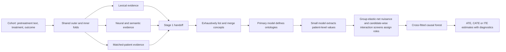
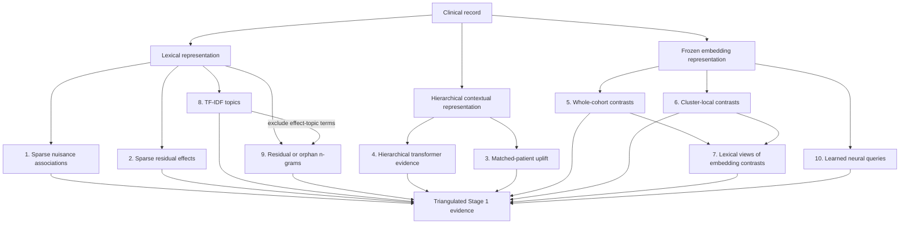

# Oncology Causal Inference (OCI)

OCI is a research codebase for finding clinically meaningful pretreatment
characteristics in longitudinal notes and using them in fold-honest causal
analyses of treatment effects and treatment-effect heterogeneity. Its primary
workflow triangulates evidence from multiple lexical, neural, semantic, and
matched-patient models in Stage 1, then uses Stage 2 to interpret that evidence,
define measurable patient variables, extract them without crossing patient or
fold boundaries, and estimate causal effects with diagnostics.

## Quickstart: 8× RTX Pro 6000

After cloning OCI and installing its system CUDA and FFmpeg prerequisites, this
is the managed-vLLM configuration for an eight-GPU RTX Pro 6000 machine. The
one-confounder, one-effect-modifier run configures GPUs 0–1 as the primary-model
pool and GPUs 2–7 as the extraction pool:

```bash
STAGE2_WORKERS=96 \
PHYSICAL_GPUS=0,1,2,3,4,5,6,7 \
STAGE2_MODEL=nvidia/Gemma-4-31B-IT-NVFP4 \
STAGE2_VLLM_GPUS=0,1 \
STAGE2_VLLM_GPUS_PER_SERVER=1 \
STAGE2_EXTRACTION_MODEL=google/gemma-4-E4B-it \
STAGE2_EXTRACTION_VLLM_GPUS=2,3,4,5,6,7 \
STAGE2_EXTRACTION_VLLM_GPUS_PER_SERVER=1 \
STAGE2_EXTRACTION_WORKERS=128 \
./run_one_conf_one_mod.sh artifacts/research_all_evidence/one_conf_one_mod_nsclc_full/
```

Use the same machine configuration for the five-confounder,
five-effect-modifier run:

```bash
STAGE2_WORKERS=96 \
PHYSICAL_GPUS=0,1,2,3,4,5,6,7 \
STAGE2_MODEL=nvidia/Gemma-4-31B-IT-NVFP4 \
STAGE2_VLLM_GPUS=0,1 \
STAGE2_VLLM_GPUS_PER_SERVER=1 \
STAGE2_EXTRACTION_MODEL=google/gemma-4-E4B-it \
STAGE2_EXTRACTION_VLLM_GPUS=2,3,4,5,6,7 \
STAGE2_EXTRACTION_VLLM_GPUS_PER_SERVER=1 \
STAGE2_EXTRACTION_WORKERS=128 \
./run_five_conf_five_mod.sh artifacts/research_all_evidence/five_conf_five_mod_nsclc_full/
```

Both wrappers default `MIN_FREE_GPU_GB` to `0`; default
`OPENBLAS_NUM_THREADS`, `OMP_NUM_THREADS`, `MKL_NUM_THREADS`, and
`NUMEXPR_NUM_THREADS` to `1`; and use `http://127.0.0.1:8010/v1` and
`http://127.0.0.1:8020/v1` as the external Stage 2 orchestration and extraction
endpoints. Explicit managed-vLLM settings bypass the corresponding localhost
default, so the commands above do not need endpoint overrides.

## Installation

OCI supports Python 3.12 and 3.13 and uses
[`uv`](https://docs.astral.sh/uv/) for reproducible environments. The complete
multi-model workflow requires NVIDIA CUDA GPUs; the default embedding model
needs approximately 20 GiB of free VRAM on each selected GPU. vLLM is optional:
an external server can use a separate environment, while pipeline-managed
servers require the `local-llm` extra in the workflow environment.

Create the project environment with:

```bash
git clone https://github.com/kenlkehl/onc-causal-inference.git
cd onc-causal-inference
uv sync --frozen
```

An editable `pip` installation is also supported when `uv` is not desired:

```bash
pip install -e .
pip install -e ".[extraction]"  # Optional API-based extraction clients.
pip install -e ".[local-llm]"   # Optional in-process/local vLLM support.
```

When installing the `local-llm` extra, provide the system CUDA and FFmpeg
libraries required by the chosen vLLM/Torch build.

## Try the complete Stage 1 → 2 workflow

Stage 2 can use already-running OpenAI-compatible servers or launch its own
pool of local vLLM servers. With no Stage 2 environment overrides, the example
launchers use orchestration at `http://127.0.0.1:8010/v1` and extraction at
`http://127.0.0.1:8020/v1`, so a bare invocation runs the complete workflow.
Ensure those servers are available, or configure managed vLLM as in the
quickstart above. To run the bundled one-confounder, one-effect-modifier NSCLC
experiment with the defaults:

```bash
./run_one_conf_one_mod.sh
```

That command synchronizes the environment, discovers visible GPUs and
their free VRAM, selects every visible GPU, sizes Stage 1 CPU workers, and runs
or resumes both stages. Results default to
`artifacts/research_all_evidence/one_conf_one_mod_nsclc_full/`.

The one-confounder wrapper defaults to four primary requests and four extraction
requests concurrently. `STAGE2_EXTRACTION_WORKERS` controls the extraction server
independently of `STAGE2_WORKERS`. The 128-worker extraction setting above is for
the six-server pool; when using one external extraction server, start with
`STAGE2_EXTRACTION_WORKERS=4`. Server queueing and response repairs consume the
same logical request deadline, so increasing timeouts alone may not resolve an
overloaded extractor. Resume into the same output directory to reuse compatible
completed checkpoints.

Extraction and forest fitting can overlap across folds. An extraction failure is
logged immediately with its checkpoint root and batch, but the final traceback
can appear later because executor shutdown waits for other in-flight work.

The most useful overrides are environment variables:

```bash
# Use exactly two eligible visible GPUs.
GPU_COUNT=2 ./run_one_conf_one_mod.sh

# Use exact host GPU IDs; CUDA remaps these to logical devices for the run.
PHYSICAL_GPUS=1,3 ./run_one_conf_one_mod.sh

# Use already-running primary and extraction servers.
STAGE2_ENDPOINT=http://127.0.0.1:8010/v1 \
STAGE2_EXTRACTION_ENDPOINT=http://127.0.0.1:8020/v1 \
STAGE2_MODEL=nvidia/Gemma-4-26B-A4B-NVFP4 \
./run_one_conf_one_mod.sh

# Or manage the primary vLLM pool while using an external extractor.
STAGE2_VLLM_SERVERS=8 \
STAGE2_MODEL=google/gemma-4-31B-it \
STAGE2_EXTRACTION_ENDPOINT=http://127.0.0.1:8020/v1 \
GPU_COUNT=8 \
./run_one_conf_one_mod.sh
```

`GPU_COUNT` and `PHYSICAL_GPUS` are mutually exclusive. The wrappers select all
visible GPUs by default because their `MIN_FREE_GPU_GB` default is `0`. Stage 2
runs independent outer folds concurrently. The one-confounder/one-modifier
launcher defaults to 4 globally bounded endpoint workers, an 1800-second HTTP
attempt timeout, and a 6000-second logical request timeout for slow reasoning
servers. The five-confounder/five-modifier launcher retains 32 workers and the
core 900/7200-second timeouts. Override these runtime settings with
`STAGE2_WORKERS`, `STAGE2_REQUEST_ATTEMPT_TIMEOUT`, and `STAGE2_REQUEST_TIMEOUT`
(timeouts are in seconds).

Advanced overrides are `MIN_FREE_GPU_GB`, `STAGE1_WORKERS`, `STAGE2_WORKERS`,
`DISABLE_HTR`, `STAGE1_ARCHITECTURES`, and `STAGE2_ENDPOINT` (set it explicitly
to empty and omit managed vLLM settings for a Stage-1-only run). Managed mode accepts
`STAGE2_VLLM_SERVERS`, optional `STAGE2_VLLM_GPUS` (the detected logical devices
are the default),
`STAGE2_VLLM_DOWNLOAD_DIR`, and a JSON token list in
`STAGE2_VLLM_EXTRA_ARGS_JSON`. Set
`OCI_PYTHON` to an existing environment's interpreter to skip `uv sync`. An
optional positional argument changes the output directory. The larger synthetic
example uses the identical hardware and endpoint behavior:

```bash
./run_five_conf_five_mod.sh
```

After a run has a completed `handoff/evidence.jsonl` checkpoint, either launcher
automatically resumes in Stage 2-only mode under the default or an explicitly
configured nonempty `STAGE2_ENDPOINT`.
That path does not inspect or reserve local GPUs: it passes `--devices cpu` for
workflow bookkeeping and uses the launcher's default endpoint worker count (or
`STAGE2_WORKERS` when set). Local GPU eligibility and `MIN_FREE_GPU_GB` apply
only while Stage 1 still needs to run. To move a resumed run to another server,
change `STAGE2_ENDPOINT` and keep the same served `STAGE2_MODEL` identifier and
scientific settings. Endpoint addresses, worker counts, and request timeouts do
not invalidate completed interpretation checkpoints.

Both launchers preset Stage 2 to consolidation batches of 20, extraction
feature batches of 10, five shifted-alphabetical plus up to fifty seeded-shuffle
consolidation rounds, a three-training-patient ontology feedback threshold, and
at most two refinement rounds. Override these with
`STAGE2_CONSOLIDATION_BATCH_SIZE`,
`STAGE2_CONSOLIDATION_ALPHABETICAL_ROUNDS`,
`STAGE2_CONSOLIDATION_MAX_ROUNDS`,
`STAGE2_OPERATIONALIZATION_MAX_PROMPT_CHARS`,
`STAGE2_EXTRACTION_FEATURE_BATCH_SIZE`,
`STAGE2_MAX_TOKENS`, `STAGE2_EXTRACTION_MAX_TOKENS`,
`STAGE2_ONTOLOGY_REFINEMENT_MIN_FAILURE_PATIENTS`, and
`STAGE2_MAX_ONTOLOGY_REFINEMENT_ROUNDS`.

## Scientific setting

For each patient or treatment decision, OCI expects a pretreatment clinical
record, a binary treatment indicator `T`, and an observed outcome `Y`. The
estimands of interest may include an average treatment effect (ATE), a
conditional average treatment effect (CATE), or an individual-level prediction
of treatment-effect heterogeneity (ITE). In an observational study, these
estimands require substantive assumptions about consistency, positivity,
interference, measurement, and the adequacy of confounding control. Text models
do not make those assumptions true; they provide additional measurements and
diagnostics with which investigators can examine them.

OCI distinguishes two causal roles for text-derived variables:

- A **confounder** is a pretreatment characteristic needed to adjust the
  treatment comparison because it is related to both treatment assignment and
  outcome.
- An **effect modifier** is a pretreatment characteristic across which the
  treatment effect may vary. A variable may have both roles.

The all-evidence workflow does not assign these roles at the moment a word,
topic, or embedding direction is discovered. It first preserves the observable
evidence and delays role assignment until the evidence has been interpreted as
a patient-level measurement.

## The all-evidence workflow

“Stage 1” and “Stage 2” are names used by this repository for two distinct
scientific tasks. They are not generic machine-learning terms.

**Stage 1 is fold-honest feature discovery.** It fits ten complementary evidence
architectures on the permitted training rows of each outer and inner context.
The outputs are words, phrases, topics, semantic witnesses, model diagnostics,
and row-aligned numerical signals. They are evidence for hypotheses about
patient characteristics; they are not yet a final covariate matrix and they are
not treatment-effect estimates.

**Stage 2 is evidence interpretation and causal operationalization.** It reviews
the Stage 1 evidence within and across architectures, consolidates supported
clinical concepts, defines how each variable will be measured in a complete
patient record, extracts those values, statistically assigns causal roles, and
fits the study's final causal forest.
Stage 2 may be human-led, language-model-assisted, or a combination of the two.
The simplified runner supplies the language-model-assisted path. A primary
OpenAI-compatible endpoint exhaustively interprets fold-scoped semantic cards,
performs merge-only consolidation, and supervises ontologies. A different small
endpoint performs the many one-patient extraction calls. Inner-fold regression
screens assign discovered confounder and modifier roles before cross-fitted
causal-forest estimation. Investigators remain responsible for judging the identification
assumptions, clinical validity, overlap, and sensitivity of the resulting
estimate; the automated review is not a substitute for scientific review.



### Why the stages are separated

The separation addresses three recurring problems in causal analysis of text.
First, different representations reveal different kinds of structure: a sparse
word model is sensitive to explicit terminology, whereas an embedding model can
recognize paraphrases and a hierarchical model can use document context. Second,
model scores are not self-interpreting. A direction in embedding space can
support a concept only after readable text witnesses establish what that
direction represents. Third, feature discovery must remain inside the relevant
training fold. If held-out outcomes influence which variable is named or how it
is defined, ordinary cross-validation no longer measures the adaptive procedure.

The default five outer folds and five inner folds produce one full outer-training
context and five inner-training contexts per outer fold. All ten architectures
use the same row definitions. The outer contexts support held-out evaluation;
the inner contexts measure whether a proposed feature is stable under changes in
the discovery sample.

### How Stage 2 uses the handoff

Stage 2 receives two kinds of information. Concept-bearing evidence contains
readable words, phrases, topics, or semantic witnesses that can support the name
of a patient characteristic. Direct numerical evidence contains fitted model
outputs that may enter the final estimator or its diagnostics. Numerical values
alone are not allowed to invent a feature name.

A complete Stage 2 analysis ordinarily performs the following sequence:

1. It interprets each architecture independently so that a large or familiar
   evidence family cannot erase a smaller one. Each compiled card is projected
   to a prompt-local integer and its readable text strings only. The model cites
   those simple integers, which Python maps back to full provenance; discovery
   lists every supported clinical feature and does not choose causal roles,
   value types, or extraction ontologies.
2. It consolidates spelling variants and genuine aliases while preserving
   clinically distinct measurements. Consolidation is merge-only; there is no
   retrieval filter or candidate cap.
3. The primary model operationalizes every consolidated candidate as one
   extractable patient-level scalar ontology.
4. A separate small model extracts every candidate on the outer-training rows,
   one patient per prompt.
5. The primary model reviews only aggregate small-model outputs and validation
   failures. It may revise the same ontology but cannot add, drop, rename, or
   role-label a feature.
6. Inner-fold multivariable elastic nets and simple univariable tests provide
   complementary confounder evidence. Candidate-augmented R-learners and a
   restored joint interaction elastic net provide complementary modifier
   evidence. An allowlisted aggregate bundle goes to the primary LLM for final
   role adjudication; investigator-configured roles remain locked.
7. It freezes the retained definitions, applies them to the outer-held-out
   records, and fits the fold-honest nuisance models and causal forest.
8. It combines held-out AIPW scores across outer folds to estimate the average
   treatment effect and writes row-level conditional effect estimates and
   overlap diagnostics.

This ordering is deliberate. Stage 1 discovers language patterns; Stage 2 turns
those patterns into scientific variables. Neither stage, by itself, establishes
causal identification.

## The ten Stage 1 evidence architectures

The word “architecture” refers here to a distinct way of generating scientific
evidence from text. The ten architectures are stored in three computational
components: `text_models`, `tfidf`, and `neural_queries`. The shared embedding
cache is infrastructure, and `handoff` is an aggregation step; neither is an
eleventh model.



Families 1 through 7 write their context-level evidence under
`components/text_models/`. Families 8 and 9 write under `components/tfidf/`,
and family 10 writes under `components/neural_queries/`. These locations remain
available after the combined handoff has been assembled.

The three families with `tfidf` in their names do not form one modeling branch.
Family 7 belongs to the embedding component: it provides a lexical view of both
the whole-cohort contrasts in family 5 and the cluster-local contrasts in family
6. Families 8 and 9 instead belong to an independent fold-local TF-IDF topic
pipeline that does not consume embeddings. Family 9 uses the effect-associated
n-gram inventory from that pipeline after removing terms already represented in
family 8's effect-topic bank. Thus family 7 depends on families 5 and 6, whereas
family 9 depends on the effect-topic term inventory from family 8.

### 1. Sparse treatment and outcome associations (`bow_nuisance`)

This architecture asks which words and short phrases help predict treatment
assignment or observed outcome within a training fold. It fits configured
bag-of-words or TF-IDF views, including linear and tree-based models, and records
the vocabulary associated with each prediction task. The model is intentionally
sensitive to explicit chart language such as diagnoses, performance status,
prior therapies, laboratory abnormalities, and administrative patterns.

The intuition is that a characteristic relevant to both treatment and outcome
may be important for adjustment. The output remains only a clue: a phrase may be
a proxy, a documentation habit, or a mixture of several clinical constructs.
Stage 2 must determine whether the phrase supports a measurable patient variable.

### 2. Sparse residual-effect associations (`bow_r_loss`)

The sparse residual-effect architecture searches for words and phrases related
to variation in treatment response after treatment and outcome nuisance
predictions have been accounted for. In R-learner notation, it studies the
residual relationship

```text
Y - m(X) approximately equals tau(X) times [T - e(X)],
```

where `e(X)` is the treatment model and `m(X)` is the outcome model. Terms that
help explain this residual relation are candidates for treatment-effect
heterogeneity. They are not proof that the named characteristic modifies the
treatment effect, but they provide a different signal from ordinary outcome
prediction.

### 3. Matched-patient uplift evidence (`matched_pair_uplift`)

This architecture constructs local comparisons between treated and untreated
patients who are similar according to learned nuisance structure. Sparse and
hierarchical text models then examine which features of a candidate patient and
the matched comparison are associated with differences in their observed
outcomes.

The method provides an intuitive counterfactual heuristic: it asks what differs
in the records of otherwise similar patients receiving different treatments.
Because matching can only balance measured and modeled information, the result
is evidence for a candidate characteristic rather than proof of an individual
treatment effect or its direction.

### 4. Hierarchical transformer evidence (`htr_neural`)

The hierarchical transformer divides a long record into overlapping clinical
chunks, encodes each chunk, and uses a document-level transformer to combine
them. Separate nuisance and residual-effect heads learn from the ordered chunk
representations. Attention and span summaries translate influential parts of the
record back into readable phrases.

This model is useful when meaning depends on context or on evidence distributed
across a long history. Unlike a bag-of-words model, it can distinguish some uses
of the same vocabulary and can combine information across notes. Its attention
weights should be read as model-use diagnostics, not as causal explanations.

### 5. Whole-cohort embedding contrasts (`embedding_whole_cohort`)

The embedding architecture encodes record chunks with a frozen sentence model
and averages them into patient-level semantic representations. Within each
training context, it constructs directions associated with treatment, outcome,
joint treatment-outcome structure, and residual-effect scores. It then retrieves
actual text chunks aligned with the positive and negative ends of those
directions.

This architecture can recognize semantically similar descriptions that do not
share exact words. The retrieved chunks are essential: the vector direction is a
numerical object, whereas the witnesses make it possible for a researcher to
judge whether the direction represents a coherent patient characteristic.

### 6. Cluster-local embedding contrasts (`embedding_clustered`)

Whole-cohort contrasts can be dominated by common documentation patterns. The
cluster-local architecture first groups semantically similar patient records and
then estimates contrast directions within those groups. It is intended to reveal
signals that are meaningful in a local region of the cohort but weak or
cancelled in a global average.

A cluster is a computational neighborhood, not an automatically valid disease
subtype. Stage 2 therefore interprets the retrieved witnesses without treating
cluster membership itself as a clinical label.

### 7. TF-IDF vocabulary from semantic retrieval (`tfidf_semantic_retrieval_contrasts`)

Both whole-cohort and cluster-local embedding contrasts return records or chunks
from opposing sides of a semantic direction. This architecture fits lexical
summaries to those contrasts and reports the terms that distinguish their sides.
Each result retains the identity of its parent contrast, so evidence derived from
a whole-cohort direction remains distinguishable from evidence derived from a
cluster-local direction. Family 7 is therefore a readable projection of families
5 and 6 rather than a third independent embedding model.

The terms can clarify whether an embedding direction concerns, for example,
disease burden, functional status, toxicity, or a documentation artifact. When
the vocabulary is nonspecific, the correct interpretation is to preserve that
ambiguity rather than force a clinical label.

### 8. Consensus TF-IDF topics (`tfidf_topics`)

This architecture begins independently from the fold's clinical text; it does
not use the embedding contrasts or their retrieved chunks. A fold-local TF-IDF
representation is screened separately for treatment, outcome, and
residual-effect signal. Non-negative matrix factorization is then fit across
configured random seeds to identify groups of terms that recur together.
Consensus across fits reduces dependence on a single topic decomposition.

A topic is a co-occurrence pattern, not necessarily one variable. A topic that
contains terms for frailty, oxygen use, and hospitalization may represent a
coherent severity construct, or it may combine several measurements that should
remain separate. Stage 2 reviews every topic member before naming a feature.

### 9. Residual or orphan TF-IDF n-grams (`tfidf_orphan_ngrams`)

This architecture is also independent of the embedding branch. It begins with
the effect-associated n-grams produced by the same fold-local TF-IDF screening
used for family 8 and removes every term already represented in the fitted topic
inventory for the residual-effect bank. The remaining words and short phrases
are the “orphans.” They can carry residual-effect signal even though they were
not represented by a retained topic.

This family is intentionally conservative about aggregation. A rare but precise
measurement may be scientifically important even when it does not belong to a
stable broad topic. Each retained n-gram is therefore treated as an independent
clue until the evidence supports a merge.

### 10. Learned neural-query moments (`neural_query_moments`)

Neural queries are trainable vectors that search the frozen chunk-embedding space
for recurring semantic patterns. Separate banks are optimized for treatment,
outcome, and residual-effect objectives, with constraints that encourage useful
activation and diversity among queries. The saved evidence includes query
activations, aggregate moments, and readable high-activation witnesses.

This approach is more flexible than a fixed mean-difference contrast because it
can learn several distinct semantic detectors for the same objective. Its
aggregate magnitudes remain numerical signals; the retrieved witnesses are what
permit a clinical concept to be proposed.

### What agreement and disagreement mean

Agreement across architectures increases confidence that a concept is not an
artifact of one representation. Disagreement is also informative. A lexical
model may identify an explicit laboratory term that an embedding model smooths
away, while an embedding model may recognize a concept expressed through many
paraphrases. The workflow preserves these differences for Stage 2 rather than
reducing all evidence to a global importance ranking.

## Running the all-evidence workflow

### Dataset requirements

The researcher-facing runner accepts Parquet and CSV files. A cohort should have
one row per patient or treatment decision and should contain the following
fields, although their names are configurable.

| Field | Required content |
|---|---|
| `patient_id` | This field provides a stable identifier for the unit of analysis. |
| `clinical_text` | This field contains the pretreatment clinical record used for discovery and modeling. |
| `treatment_indicator` | This field is binary, with values zero and one. |
| `outcome_indicator` | This field is binary or continuous, as declared by `outcome_type`. |
| `split` | This optional field can identify fixed `train`, `val`, and `test` partitions for standalone runs. |

Post-treatment notes should not be included when they reveal treatment response,
toxicity, or other descendants of treatment. The software can enforce fold
boundaries, but it cannot determine whether a note is temporally appropriate for
the scientific question.

### A configuration file

Copy [`example_configs/research_all_evidence.json`](example_configs/research_all_evidence.json)
and edit the dataset, output, column, and scientific settings. A typical file has
the following form:

```json
{
  "dataset": "/data/cohort.parquet",
  "output_dir": "/results/nsclc_all_evidence",
  "columns": {
    "unit_id": "patient_id",
    "text": "clinical_text",
    "treatment": "treatment_indicator",
    "outcome": "outcome_indicator"
  },
  "science": {
    "clinical_question": "Which pretreatment characteristics confound treatment selection or modify treatment effect?",
    "outcome_type": "binary",
    "outer_folds": 5,
    "inner_folds": 5,
    "seed": 42,
    "stage1": {},
    "neural_queries": {}
  },
  "models": {
    "htr": "prajjwal1/bert-tiny",
    "embeddings": "Qwen/Qwen3-Embedding-8B"
  },
  "stage2": {
    "endpoint": "",
    "model": ""
  },
  "run": {
    "mode": "stage1",
    "devices": ["cuda:0", "cuda:1"],
    "workers": 16,
    "components": [
      "embedding_cache",
      "tfidf",
      "text_models",
      "neural_queries",
      "handoff"
    ]
  }
}
```

Paths in a configuration file are resolved relative to that file. JSON and YAML
are accepted; YAML requires PyYAML. Less common model settings can be placed
under `science.stage1` or `science.neural_queries`. The resolved settings used by
the run are written beside the results.

`science.stage1_architectures` is an optional list of architecture names. When
it is omitted, the workflow preserves the existing enable-flag behavior and
runs every architecture enabled by the Stage 1 model configuration. An explicit
selection runs only the required producer components and private prerequisites,
and exposes only the selected architecture lanes to Stage 2. For example:

```bash
uv run python scripts/run_all_evidence.py \
  --config run.json \
  --architectures bow_nuisance,tfidf_topics
```

Architecture selection is part of the scientific run definition. Resume with
the same selection; use a fresh output directory to change it. `--architectures
all` explicitly selects all ten lanes.

Chunk-based models fail rather than silently discard the end of an unusually
long record. If a capacity error reports that a record requires more embedding
chunks, the limit can be increased without editing the base template. For
example, `--set science.stage1.architecture.multi_model_forest.embedding_contrast.max_chunks=128`
sets a nonbinding capacity for records that require no more than 128 chunks.

Start or resume the run with one command:

```bash
uv run python scripts/run_all_evidence.py --config run.json
```

`scripts/run_all_evidence.py` orchestrates the complete multi-model Stage 1 and
Stage 2 workflow. Fold-local BoW, HTR, embedding, matched-pair, and
structured-effect settings live under
`science.stage1.architecture.multi_model_forest`.

The same program accepts direct arguments when a separate configuration file is
not useful. The following command defines an equivalent Stage 1 run explicitly:

```bash
uv run python scripts/run_all_evidence.py \
  --dataset /data/cohort.parquet \
  --output-dir /results/nsclc_all_evidence \
  --unit-id-column patient_id \
  --text-column clinical_text \
  --treatment-column treatment_indicator \
  --outcome-column outcome_indicator \
  --outcome-type binary \
  --clinical-question "Which pretreatment characteristics confound treatment selection or modify treatment effect?" \
  --outer-folds 5 \
  --inner-folds 5 \
  --devices cuda:0,cuda:1 \
  --workers 16 \
  --stage1-only
```

The bundled one-confounder, one-effect-modifier NSCLC example can also write to
an explicit output directory:

```bash
./run_one_conf_one_mod.sh /persistent/results/nsclc_example
```

### Parallel execution

The workflow runs its top-level components in order because later components
reuse artifacts or split definitions produced by earlier ones. Parallelism is
applied within the computationally expensive components. The embedding cache
divides the ordered chunk corpus among the configured GPUs. TF-IDF discovery
uses separate CPU processes across independent outer/full and exact-inner
contexts. Each process performs one context's vectorization, screening,
stability analysis, and topic fitting with one native numerical thread. This
process boundary is important because several parts of topic discovery are
Python-heavy and would contend if they shared one interpreter. The number of
simultaneous context processes is the smaller of the unfinished context count
and `run.workers`. The text-model and neural-query components also treat each
outer/full or exact-inner discovery context as an independent job.

Thread pools are retained where they have different semantics: concurrent
endpoint requests, work assigned to distinct GPU devices, and nested
scikit-learn fits inside an already isolated text-model process. These tasks
either wait on I/O, execute outside the Python interpreter, or avoid the memory
cost and instability of nested process pools. Python-heavy TF-IDF context work
does not use the thread backend by default.

For CUDA runs, the runner creates one fixed process lane per configured GPU and
assigns whole contexts to those lanes. A lane remains attached to the same GPU,
which prevents two contexts from being scheduled onto one device merely because
another device finished early. The number of active lanes is the smaller of the
number of configured CUDA devices and the number of unfinished contexts. The
runner assigns the largest contexts first to the currently least-loaded lane.

During `text_models`, the total CPU budget is divided as evenly as possible
among the active lanes. If the division has a remainder, the first lanes receive
one additional worker. Within a lane, independent BoW cross-fitting folds and
the treatment, outcome, and effect-importance fits use up to that lane's worker
allocation as threads. The native numerical libraries remain single-threaded
within each fit, which prevents nested work from exceeding the stated CPU
budget. A neural-query context uses its assigned GPU for its inner-fold fits,
final query banks, and evidence retrieval; its parallelism occurs across
contexts rather than by oversubscribing the device within a context.

The `run.devices` setting determines GPU-lane concurrency. `run.workers` is the
overall CPU budget used by TF-IDF and divided among the concurrently active
text-model lanes. If fewer workers than CUDA devices are requested, each active
device still requires one controller worker. Stage 2 uses its own
`stage2.workers` setting for primary requests,
`stage2.extraction_llm.workers` for patient extraction. Deterministic Stage 2
evidence is computed inside each fold. Pairwise evidence uses deterministic,
checkpointed chunks submitted by all outer folds to one shared loky process
pool capped by `stage2.workers`. Bounded variable-selection agents use
the shared primary-request budget. Independent outer folds run concurrently,
while a shared request semaphore keeps their combined endpoint concurrency at
`stage2.workers`. Review and role-agent rounds within each fold remain ordered.
Every Stage 1 context and every expensive Stage 2 batch writes its own
`complete.json`, so the same scheduling remains resumable after interruption.

### Stage-specific execution

When neither a Stage 2 endpoint nor a managed vLLM pool is configured, the
workflow stops after Stage 1. This is useful when a researcher wishes to inspect
the discovery evidence before permitting any variables to enter the causal
analysis.

```bash
uv run python scripts/run_all_evidence.py --config run.json --stage1-only
```

When a Stage 2 endpoint has been configured, the same entry point can run the
complete second stage against an existing handoff:

```bash
OPENBLAS_NUM_THREADS=1 \
OMP_NUM_THREADS=1 \
MKL_NUM_THREADS=1 \
NUMEXPR_NUM_THREADS=1 \
uv run python scripts/run_all_evidence.py \
  --config run.json \
  --stage2-only \
  --stage2-endpoint http://127.0.0.1:8010/v1 \
  --stage2-extraction-endpoint http://127.0.0.1:8020/v1
```

Set these thread limits before starting Python directly on high-core-count
machines. The two synthetic wrapper scripts set all four to `1` by default.
Stage 2 already controls primary-model request concurrency with `stage2.workers`
and extraction concurrency with `stage2.extraction_llm.workers`; allowing
OpenBLAS, OpenMP, MKL, or NumExpr to create another native thread pool per
concurrent task can exhaust OpenBLAS's thread metadata or memory regions and
terminate the process. Every live endpoint is probed through `/models`. An
omitted model is resolved only when exactly one ID is advertised; an explicit
model must be among the advertised IDs.

A configured endpoint or managed vLLM pool makes the unflagged default a full
Stage 1 and Stage 2 run. The API key may be stored in `stage2.api_key` or
supplied through `OCI_STAGE2_API_KEY`. For example:

```json
{
  "stage2": {
    "endpoint": "http://127.0.0.1:8010/v1",
    "model": "Qwen/Qwen3.8-27B",
    "workers": 32,
    "extraction_llm": {
      "endpoint": "http://127.0.0.1:8020/v1",
      "model": "Qwen/Qwen3-4B-Instruct-2507",
      "api_key": "EMPTY",
      "workers": 32
    },
    "request_timeout": 7200,
    "request_attempt_timeout": 900,
    "transport_max_attempts": 6,
    "max_tokens": 100000,
    "extraction_max_tokens": 75000,
    "max_response_repairs": 15,
    "thinking_after_response_repairs": 5,
    "repetition_penalty": null,
    "interpretation_reasoning_effort": "high",
    "extraction_reasoning_effort": "none",
    "evidence_compiler": "semantic_cluster_cards_v2",
    "evidence_max_cards_per_fold": 400,
    "evidence_max_exemplars_per_card": 4,
    "evidence_max_exemplar_chars": 2400,
    "operationalization_max_prompt_chars": 640000,
    "consolidation_batch_size": 20,
    "consolidation_alphabetical_rounds": 5,
    "consolidation_max_rounds": 55,
    "extraction_feature_batch_size": 10,
    "extraction_chunk_size_tokens": 50000,
    "extraction_context_window_tokens": 131072,
    "extraction_context_margin_tokens": 1024,
    "max_review_rounds": 2,
    "ontology_refinement_min_failure_patients": 3,
    "max_ontology_refinement_rounds": 2,
    "input_temporal_scope": "pre_index_treatment",
    "statistical_selection": {
      "l1_ratio": 0.8,
      "nuisance_selection_rule": "any_inner_fold_union",
      "modifier_selection_rule": "any_inner_fold_union",
      "internal_cv_folds": 3,
      "regularization_grid_size": 16,
      "optimization_tolerance": 1e-6,
      "one_standard_error_rule": true,
      "nuisance_prediction_one_standard_error_rule": false,
      "modifier_one_standard_error_rule": false,
      "univariable_confounder_p_value_threshold": 0.05,
      "univariable_confounder_q_value_threshold": 0.10,
      "modifier_top_n_per_inner_fold": 10,
      "modifier_ridge_alpha": 10.0,
      "modifier_continuous_winsor_quantile": 0.005
    },
    "role_adjudication": {
      "enabled": true,
      "max_candidates_per_request": 20
    },
    "estimation_trees": 200,
    "explicit_features": []
  },
  "run": {
    "mode": "full"
  }
}
```

`stage2.model` is optional. When it is empty or omitted, Stage 2 queries the
endpoint's OpenAI-compatible `/models` API and uses the advertised model if
exactly one model ID is returned. Configure `stage2.model` explicitly when the
endpoint advertises multiple IDs. Dataset-backed Stage 2 also requires
`stage2.extraction_llm`. Its endpoint may differ from the primary endpoint or
may be the same multi-model endpoint. Its `model` is resolved by the same
one-model rule when omitted.

### Pipeline-managed vLLM server pools

The pipeline can independently own the orchestrator and extractor vLLM
lifecycles. For the orchestrator, omit `stage2.endpoint`, provide
`stage2.model`, and add `stage2.vllm`. For the extractor, omit
`stage2.extraction_llm.endpoint`, provide its `model`, and add the nested
`stage2.extraction_llm.vllm`. This example runs one tensor-parallel orchestrator
on GPUs 0-1 and two one-GPU extractor replicas on GPUs 2-3:

```json
{
  "stage2": {
    "model": "Qwen/Qwen3.8-27B",
    "workers": 32,
    "vllm_rapid_switch_seconds": 900,
    "extraction_llm": {
      "model": "LiquidAI/LFM2.5-2.6B",
      "workers": 64,
      "vllm": {
        "gpus": ["cuda:2", "cuda:3"],
        "gpus_per_server": 1,
        "base_port": 8110,
        "download_dir": "/models/huggingface",
        "extra_args": ["--gpu-memory-utilization", "0.80"]
      }
    },
    "vllm": {
      "gpus": ["cuda:0", "cuda:1"],
      "gpus_per_server": 2,
      "base_port": 8010,
      "download_dir": "/models/huggingface",
      "extra_args": [
        "--gpu-memory-utilization", "0.90",
        "--max-model-len", "65536"
      ]
    }
  },
  "run": {
    "mode": "stage2"
  }
}
```

Each managed role has its own allowed GPU list and `gpus_per_server`
tensor-parallel width. The configured replica count is derived as
`len(gpus) / gpus_per_server`;
`server_count` may also be supplied, but must agree. GPU indices use the
pipeline's current logical CUDA namespace. If the parent has
`CUDA_VISIBLE_DEVICES`, each child assignment is mapped through it. Uneven
divisions, duplicate GPUs within a pool, inconsistent counts, and more servers
than GPUs are rejected before any process starts.

When both models are managed, Stage 2 initially keeps only one model resident at
a time. It loads the orchestrator across the ordered union of both GPU lists for
interpretation and feature definition, checkpoints that work, unloads it, and
loads the extractor across the same union. Later ontology-supervision barriers
switch the complete union back to the orchestrator; revised ontologies and
held-out extraction switch it back to the extractor as needed. Each role
preserves its configured tensor-parallel width and adds replicas when that width
evenly divides the union; otherwise it uses one tensor-parallel server across
the complete union. Added replicas receive consecutive ports in that role's
configured range.

The runner measures each interval between switches. If consecutive switches are
less than `stage2.vllm_rapid_switch_seconds` apart (900 seconds by default), it
stops all-GPU alternation and keeps both models resident for the rest of the run.
In that fallback, each role uses its exact configured `gpus`,
`gpus_per_server`, replica count, and ports. Set the value to `0` to disable the
fallback. Feature-definition-only runs never load the extractor. Resumes use
`stage2/vllm_servers/model_phase.json` plus ordinary scientific checkpoints to
reload the required role or retain a previously selected concurrent split.

Both nested managed configurations accept `host`, `base_port` (or an exact
`ports` list), `internal_port_base`, and `gpus_per_server`. The settings
`startup_timeout`, `startup_poll_interval`, and `shutdown_timeout` control the
server lifecycle. `download_dir`, `reasoning_parser`, `language_model_only`, and
`default_chat_template_kwargs` map directly to their vLLM options. Any remaining
vLLM options can be supplied as individual command tokens in `extra_args`.
Model, host, port, tensor-parallel size, API key, and the named options above are
owned by the pipeline and cannot also be overridden in `extra_args`.

Recognized model families get these defaults unless the corresponding setting
is explicitly overridden:

- Gemma model names: `reasoning_parser: "gemma4"`,
  `language_model_only: true`, and no server-wide thinking default.
- Qwen model names: `reasoning_parser: "qwen3"` and
  `language_model_only: true`.

Reasoning is selected in each Chat Completions payload instead of in the vLLM
server command. Primary-model interpretation requests send
`reasoning_effort: "high"` by default; this includes
evidence interpretation and audit, consolidation, operationalization, feature
ontology supervision, category mapping, and ontology refinement. One-patient
value-extraction requests use the configured small model with
`reasoning_effort: "none"`. Both models may share an endpoint. Primary-model
requests receive the configured `max_tokens` output ceiling (100,000 by
default), while patient extraction receives `extraction_max_tokens` (75,000 by
default; it may be lowered to a 4,096-token safety cap when an extractor fails
to emit EOS). These ceilings permit long output but do not force generation to
their limits. Extraction dynamically lowers that ceiling for a repair attempt
when retaining it would exceed the remaining context. Stage 2
detects Qwen 3 (including 3.8), Gemma 4, and LFM 2.5 IDs and sends their
template-level thinking switch, with portable prompt and request-field
fallbacks for non-vLLM servers. It parses either separate reasoning fields or
inline reasoning delimiters. The two efforts are recorded as
`interpretation_reasoning_effort` and `extraction_reasoning_effort` in the
Stage 2 configuration. Stage 2 resolves sampling defaults from the serving model family; explicit
sampling settings override those defaults. See [sampling profiles](docs/stage2_sampling.md).
For Qwen 3.8, the model-agnostic `high` policy is translated to the endpoint's
`reasoning_effort: "xhigh"` wire value. Disabled extraction thinking omits the
wire-level effort enum and uses the family-specific hard-off controls.

A logical request, including transport retries and validator-guided repair
turns, is bounded by `request_timeout` (7200 seconds by default in the core
configuration). The clock starts after acquiring a global request slot; time
waiting locally for that slot is excluded and logged separately. The request
holds its slot through retries and response repairs, so they do not requeue
behind other folds. Server-side queueing still consumes the request budget.
Each HTTP call is bounded by `request_attempt_timeout` (900 seconds by default), so a
straggling endpoint can be abandoned and retried. Transport retries include the
latest error in the model prompt, preserving existing validation feedback. The
original input is retained losslessly; retries stop if error feedback cannot fit
the prompt budget. A transport failure receives
up to `transport_max_attempts` attempts (6 by default). A completed response
that fails JSON parsing or schema validation receives up to
`max_response_repairs` validator-guided retries (15 by default), each with the
concrete validation error. Repair attempts through
`thinking_after_response_repairs` (5 by default) retain the request's normal
reasoning policy; later repairs force `reasoning_effort` to at least `high`,
which enables thinking for the managed vLLM reasoning parsers.

The equivalent direct CLI invocation is:

```bash
uv run python scripts/run_all_evidence.py \
  --config run.json \
  --stage2-only \
  --stage2-model Qwen/Qwen3.8-27B \
  --stage2-vllm-gpus cuda:0,cuda:1 \
  --stage2-vllm-gpus-per-server 2 \
  --stage2-vllm-rapid-switch-seconds 900 \
  --stage2-vllm-download-dir /models/huggingface \
  --stage2-vllm-extra-arg=--gpu-memory-utilization \
  --stage2-vllm-extra-arg=0.90 \
  --stage2-extraction-model LiquidAI/LFM2.5-2.6B \
  --stage2-extraction-workers 64 \
  --stage2-extraction-vllm-gpus cuda:2,cuda:3 \
  --stage2-extraction-vllm-gpus-per-server 1 \
  --stage2-extraction-vllm-download-dir /models/huggingface \
  --stage2-extraction-vllm-extra-arg=--gpu-memory-utilization \
  --stage2-extraction-vllm-extra-arg=0.80
```

The runner waits until every server in the active pool advertises its
configured model at `/v1/models` before inference. Logs and redacted manifests
are written under `stage2/vllm_servers/orchestrator_all_gpus/`,
`stage2/vllm_servers/extractor_all_gpus/`,
`stage2/vllm_servers/orchestrator/`, and
`stage2/vllm_servers/extractor/`, as applicable. On normal completion,
interruption, startup failure, or a Stage 2 error, it terminates every managed
process group. Either role may instead use an external endpoint, so
managed/external combinations are supported independently. All-GPU staging
applies only when both roles are pipeline-managed. Within each role, its
endpoint and vLLM pool are mutually exclusive.

The synthetic-run shell wrappers expose the same split through
`STAGE2_VLLM_GPUS` and `STAGE2_VLLM_GPUS_PER_SERVER` for the orchestrator, and
`STAGE2_EXTRACTION_VLLM_GPUS` plus
`STAGE2_EXTRACTION_VLLM_GPUS_PER_SERVER` for the extractor. Positive
`STAGE2_VLLM_SERVERS` and `STAGE2_EXTRACTION_VLLM_SERVERS` values may be used
instead of deriving replica counts, provided they agree with the selected GPU
lists and GPUs-per-server settings. `STAGE2_VLLM_RAPID_SWITCH_SECONDS` controls
the adaptive fallback cutoff. Their default public port ranges begin at 8010
and 8110, respectively.

To guarantee inclusion of an investigator-specified variable, populate
`stage2.explicit_features` with complete definitions containing `name`,
`description`, `value_type`, `categories_or_unit`, `measurement_definition`,
`missing_value_rule`, and causal `roles`. These definitions participate in the
same per-fold alias consolidation as discovered candidates. A discovered alias
is merged into the configured feature and contributes provenance, but the
configured name, roles, and ontology remain authoritative and no ontology-
definition request is made for that group. Aggregate ontology supervision and
statistical screening cannot drop it, change its roles, or revise its ontology.
See
[`docs/all_evidence_workflow.md`](docs/all_evidence_workflow.md) for a complete
example and validation rules.

Stage 2 extraction is permanently isolated to one patient per model prompt. It
queries at most `stage2.extraction_feature_batch_size` definitions per prompt
(10 by default), checkpoints each feature slice, and merges the slices before
review. A record longer than the available prompt envelope is processed in
source order with lossless contiguous chunks capped by
`stage2.extraction_chunk_size_tokens` (50,000 by default). Each validated
structured extraction becomes the prior state for the next chunk. The planner
counts the extraction model's chat tokens and shrinks a chunk when definitions
or carried state need more room under `extraction_context_window_tokens`
(131,072) and `extraction_context_margin_tokens` (1,024). Chunk results are
independently checkpointed, so a restart resumes at the first unfinished chunk.
The extraction model's tokenizer must therefore be available locally under its
configured model ID (the managed vLLM download directory or Hugging Face cache).
The CLI equivalents begin with `--stage2-extraction-*`.
Concurrency is controlled by `stage2.extraction_llm.workers`; patient batching
is not configurable.

Stage 2 preserves the outer-fold boundary throughout variable construction and
estimation. Before the first LLM request, its default evidence compiler reuses
the scientific allowlisting in `all_evidence_fusion`, removes exact duplicates
with provenance retained, and builds a conservative fold-local semantic-card
atlas. Compatible clinical chunks reuse the existing Stage 1 embedding cache by
memory map; other evidence uses deterministic lexical projections, so this step
does not load another embedding model beside the serving process. The raw Stage
1 evidence remains unchanged, while cards, exact members, lineage, and a
reduction audit are written under `stage2/evidence_compilation/`. The compiled
packet plan is cached and input-fingerprinted for fast, safe restarts.

Stage 2 sends every compiled semantic evidence card to exhaustive feature
discovery. The primary model must list every pretreatment patient-level clinical
feature mentioned or implied by the supplied cards, and one evidence item may
support many candidates. There is no ColBERT routing, evidence-community graph,
candidate retrieval, candidate-count cap, or causal-role filter. All discovered
candidates enter merge-only consolidation; oracle metadata never participates.

`semantic_cluster_cards_v2` is the only supported Stage 2 evidence compiler.
Before any interpretation request, it compares the architectures present in
each outer fold with the run's frozen Stage 1 selection: either the explicit
selector or, for legacy runs, the resolved enable flags. A missing selected
architecture stops with a direct instruction to rerun its Stage 1 component and
rebuild the handoff. This is a local
scientific completeness check; it does not introduce artifact authentication,
bundle attestation, checkpoint adoption, or deployment gates. The former
`raw_packets_v1` option was retired because it merged distinct architectures
into broad prompt buckets.

Stage 2 then consolidates the candidates discovered from compiled packets into
operational patient-level definitions. After exact-name
coalescing, consolidation alphabetically sorts candidates into batches of 20
by default, applies each batch's merge directives, re-sorts the consolidated
versions, and repeats for up to 55 rounds. The first five rounds shift
alphabetical boundaries; the remaining 50 use reproducible seeded shuffles of
the remaining pool so lexically distant aliases can be considered together
without requiring one large response. There are no fuzzy-blocked or pairwise
alias requests. The batches can merge synonymous, thresholded, categorical,
quantitative-score, and value-encoded representations. They cannot exclude any
candidate: every unmerged feature passes through unchanged. Explicit
investigator-configured features are hard invariants in every round: they
cannot be renamed, distinct configured features cannot be merged, and their
supplied ontology and roles remain authoritative. Python deterministically carries supporting packets,
architectures, evidence axes, descriptions, and original-candidate dispositions
through the rounds. Discovered features have no causal role at this point;
roles are assigned only by the later statistical screens. Finally, independent one-feature requests receive only the
canonical feature name and a deduplicated flat list of readable supporting-text
strings. The model decides the value type, units or allowed categories,
measurement rule, and missingness handling from that evidence; packet structure,
evidence kind, detail objects, truncation flags, fold metadata, internal IDs,
causal axes, semantic grouping, architecture names, scores, support counts,
candidate summaries, and earlier proposed value types stay outside the prompt.
Operationalization has an independent 640,000-character prompt allowance. If a
large merged alias family has more readable evidence than fits with repair
headroom, Python deterministically packs whole excerpts under the limit and
records the available, included, omitted, and truncated evidence counts plus a
fingerprint of all available evidence. A malformed ontology still receives the
bounded repair attempts; if it remains invalid, Python records an explicit
fallback artifact and uses a conservative `ambiguous` ontology for training-fold
extraction and aggregate supervision instead of aborting the outer fold.
Every consolidation round/batch and one-group operationalization request is
input-fingerprinted separately, so a retry skips successful leaves instead of
repeating the whole fan-out. Batch size and maximum rounds are configurable as
`stage2.consolidation_batch_size`, `stage2.consolidation_alphabetical_rounds`,
and `stage2.consolidation_max_rounds`. When a
model copies a uniquely supplied candidate description where an exact name was
requested, Python maps that description back to its name; it also restores a
reused output omitted from its own merge inputs. Degenerate one-feature merges
are ignored. If one batch remains structurally invalid after bounded repairs,
that batch is recorded as a conservative passthrough and all its candidates are
retained, so a malformed optional consolidation response cannot discard an
explicit feature or abort the fold.

The small extraction endpoint then extracts every consolidated candidate on the
outer-training records, one patient per prompt. A
feature defined as continuous may preserve a documented category or threshold
when the record has no exact number. When both numeric and categorical values
appear, a primary-model harmonization step sees only outer-training values and
chooses one common continuous or categorical ontology. The validated plan is
then frozen and applied deterministically to training and held-out rows;
categorical ranges are not silently coerced to invented numeric midpoints.
When later training rounds expose new text tokens, Stage 2 keeps the frozen
ontology and requests mappings only for those new tokens. Empty, extra, missing,
or duplicate mapping rows are normalized conservatively and audited; ambiguous
or conflicting mappings become null. If bounded validation repairs still cannot
produce a safe plan, `fallback.json` records the failure and the fold continues:
a valid prior plan is retained with unresolved new tokens mapped to null, while
a feature without a prior plan retains its raw mixed values under
`continuous_with_categorical_fallback` modeling. Final fold definitions and the
run summary retain these fallback records for audit.

The primary model then reviews each candidate's aggregate extracted values and
validation failures. It receives no patient text, treatment or outcome values,
causal-role evidence, performance metric, or p-value. It may keep or revise the
same candidate's description, value type, categories or unit, measurement rule,
and missingness rule, but cannot add, drop, split, merge, rename, or role-label a
feature. Any revision triggers small-model re-extraction. This bounded
supervision runs for at most `max_review_rounds` (two by default), and explicit
investigator ontologies are locked.

Re-extraction is incremental: only candidates whose prompt-facing extraction
definition changed are sent back through the small model. Their columns are
merged into the cached raw training matrix, while unchanged candidate columns
are reused. Prompts still contain exactly one patient; feature batching within
that patient is unchanged.

Stage 2 first performs an optional sequential consolidation after the extracted
candidate ontology is frozen and before any supervised role selection. For each
still-active candidate, a local embedding model retrieves the ten nearest
currently active candidates by default. Mixed-type pairwise association evidence
is calculated from outer-training rows only, and the primary model either leaves
the cluster unchanged or defines a canonical representation of truly equivalent
measurement aliases. Every source pair must have association of at least 0.85 by
default, but association is only a necessary condition. Broader/narrower
concepts, components and totals, and merely related variables cannot be merged.
An accepted alias must preserve value type, category granularity, units, and
missingness; it is populated immediately from a validated coalesce or lossless
category-recode rule. A nominal categorical recode may use the union of
source vocabularies, and continuous coalescing skips malformed nonnumeric source
values in favor of the next valid alias. On every row where multiple valid
sources are nonmissing, their numeric values or canonical recoded categories
must agree; a conflict rejects the replacement instead of silently letting the
first source win. The canonical measurement replaces its
sources in the active pool and can be
retrieved by later candidates. Original columns and recursive lineage remain
available for audit and held-out reconstruction. Configured explicit features
are protected from replacement.

Stage 2 then builds fold-honest role evidence. In every inner fold, a logistic group elastic net predicts treatment
and a separate group elastic net predicts the marginal outcome. Continuous and
ordered measurements are standardized single-score groups, while every nominal
factor's standardized contrasts and missingness indicator form one all-in/all-out
group. Any feature group selected in at least one inner fold for either task
enters a provisional confounder union. Candidate-wise omnibus screens also test
treatment, outcome, and treatment-adjusted outcome associations, retaining raw
p-values, within-fold FDR values, and fold support. Both nuisance models used to
build modifier evidence use the provisional union. Reports include
inner-heldout and pooled out-of-fold AUROC as well as log loss for binary tasks.

Inner-fold grouped elastic nets produce cross-fitted propensity and marginal-
outcome predictions. For every candidate, candidate-specific grouped elastic-
net calibration layers augment both nuisances using only inner-fold training
data. A ridge-stabilized R-learner compares a constant-effect model with a model
that jointly adds all estimable candidate interaction contrasts, and scores the
gain on untouched inner-heldout rows. The ten largest held-out R-loss gains enter
each inner fold's evidence set by default, without a sign or p-value gate. A
second R-loss model places all candidate interaction groups in one joint grouped
elastic net and records coefficient support plus held-out whole-model gain. The
nuisance screens continue to use the one-standard-error rule, while nuisance
prediction defaults to the minimum-CV-loss elastic net.

Final primary-model adjudication receives only allowlisted definitions and these
aggregate statistics. Large candidate sets are sliced into bounded requests of
`stage2.role_adjudication.max_candidates_per_request` candidates (20 by
default); each slice retains the global fold votes, ranks, and method evidence
for its candidates. The adjudicator reconciles all methods and fold consistency,
assigning both roles or neither when warranted. The prompt interface excludes
dataset rows, identifiers, outer-heldout information, oracle fields, paths or
names, and generation metadata; failure does not silently fall back to
provisional statistical unions.

The consolidation agent never receives treatment, outcome, or outer-heldout
rows; pairwise associations are used only for this unsupervised replacement
decision and never as a causal-role screen. Investigator-configured roles remain
locked. All supplied measurements must satisfy the persisted
`pre_index_treatment` invariant, and outer-heldout rows remain unavailable until
the selected definitions and model roles are frozen.

All-evidence selection writes its own input fingerprint and completion
marker, so an interrupted run resumes independently. Endpoint URLs are transport
details and may change between resumes. The root `model_identity.json` records
the model IDs used for upstream interpretation and extraction. Completed
interpretation, consolidation, and operationalized feature definitions remain
reusable because statistical-selection settings do not participate in their
fingerprints.

Each patient extraction also records feature-attributable validation failures.
After the training patients finish, Stage 2 aggregates repeated failures across
distinct patients. By default, three patients with the same feature-level
failure trigger a bounded ontology-refinement request followed by re-extraction;
up to two such refinement rounds are allowed. The request sees the current
definition, aggregate failure counts, and failed model outputs, but no patient
text or held-out data. It can refine only the same feature's description, value
type, categories or unit, measurement rule, and missingness rule. Malformed JSON
or response-envelope failures are reported separately and never treated as
ontology evidence. Explicit investigator-supplied ontologies remain immutable
and are only audited when they repeatedly fail.

Each refinement pass re-extracts only the features whose extraction definitions
changed, then merges those refreshed columns with the unchanged cached columns.
Failure summaries are merged on the same boundary: refreshed features replace
their old patterns, while unchanged-feature and structural failures remain
available to later supervision.

Only after supervision and inner-fold selection end are the retained definitions
applied to outer-held-out records. The final heterogeneous-effect model is an
honest `CausalForestDML`: effect modifiers form its heterogeneity matrix and
pure confounders form its controls (a dual-role variable is represented once in
the heterogeneity matrix). If no modifier survives, a constant effect design
keeps the final model a causal forest. Cross-validated elastic-net nuisance
models are fit without using outer-held-out outcomes and produce held-out
propensities, potential-outcome predictions, and AIPW scores. `CausalForestDML`
cross-fits the same nuisance family internally. The causal forest supplies
held-out conditional effects and confidence intervals; combining outer-held-out
AIPW scores across folds supplies the reported cross-fitted average treatment
effect and confidence interval. The retired strict random-forest runtime-config
module is not an alternate estimator path. Fold diagnostics audit every fitted
elastic-net nuisance clone, including effective CV folds, selected
regularization, and optimizer iteration-limit status.

```mermaid
flowchart LR
    A["Semantic evidence cards<br/>for one outer fold"] --> B["Exhaustive primary-model<br/>feature listing"]
    B --> C["Merge-only consolidation<br/>and operationalization"]
    C --> D["Small model extracts every candidate<br/>on outer-training records"]
    D --> E["Primary model reviews<br/>aggregate ontology"]
    E -->|"ontology revised"| D
    E -->|"frozen"| F["Sequential equivalence-only<br/>alias consolidation"]
    F --> G["Group-elastic-net nuisance screens<br/>and top-N interaction selection"]
    G --> H["Small model extracts retained<br/>outer-held-out dependencies"]
    H --> I["Causal forest and<br/>held-out AIPW scores"]
    I --> J["Aggregate all outer folds"]
```



### Output and interruption recovery

The output directory is both the result location and the resumable checkpoint.
There is no separate run registry or resume token.

```text
nsclc_all_evidence/
  run_config.json
  resolved_stage1_model_config.json
  resolved_neural_query_config.json
  progress.json
  logs/
    workflow.log
  components/
    embedding_cache/
      cache/...
      complete.json
    tfidf/
      predictions.parquet
      split_provenance.jsonl
      evidence.jsonl
      stage1_tfidf_topics/contexts/...
      complete.json
    text_models/
      outer_001_full/...
      outer_001_inner_001/...
      evidence.jsonl
      complete.json
    neural_queries/
      outer_001_full/...
      outer_001_inner_001/...
      evidence.jsonl
      complete.json
  stage1_architectures/              # explicit --architectures runs only
    manifest.json
    bow_nuisance/evidence.jsonl
    ...
  handoff/
    evidence.jsonl
    index.json
    complete.json
  evaluations/
    stage1/
      evaluation_manifest.json
      metrics.jsonl
      comparison.csv
      summary.json
      architectures/.../metrics.jsonl
  stage2/
    config.json
    evidence_compilation/
      packets.jsonl
      outer_001/{cards,members,lineage}.jsonl
    outer_001/
      input_packets.jsonl
      interpretations/...
      consolidation/...
      feature_definitions.json
      ontology_supervision/
        supervisor_cache/<fingerprint-prefix>/<fingerprint>/...
        round_001/
          extraction/...
          aggregate_extraction_summary.json
          supervisor/...
          complete.json
        convergence.json
      preselection/                 # present after guarded reselection
        input.json
        complete.json
      selection/
        candidate_consolidation/
          input.json
          steps/...
          registry.json
          report.json
          complete.json
        statistical_evidence.json
        role_adjudication/
          evidence.json
          prompt.json
          batches/batch_NNN/{prompt.json,response.json,complete.json}
          response.json
          complete.json
        elastic_net_selection.json
        selected_definitions.json
        measurement_definitions.json
        selected_latent_states.json       # selected latents and recursive ancestors
      final_definitions.json
      extraction/
        fit/extracted.csv
        heldout/harmonized.csv
        extracted_features.csv
      estimation/
        predictions.csv
        diagnostics.json
        complete.json
      complete.json
    features_by_outer_fold.jsonl
    cross_fitted_predictions.csv
    posthoc_predictions_with_oracle_ite.csv
    posthoc_oracle_ite_metrics.json
    causal_estimate.json
    summary.json
    reselection_state.json          # present after guarded reselection
    reselection_archives/...
    complete.json
```

`progress.json` provides the current component and status. The workflow log is
written to `logs/workflow.log`, and model-specific intermediate results are kept
under `components/<name>/`. Stage 2's intermediate scientific results are under
the current `stage2/outer_NNN/` directory: this is the direct place to inspect
the candidates, aggregate ontology reviews, elastic-net stability diagnostics,
selected roles, extractions, and causal-forest estimates. If a process is
interrupted, rerunning the same command skips each completed interpretation,
consolidation, extraction, ontology-supervision, and estimation leaf, then
re-enters the first incomplete directory. Across ontology rounds, aggregate
supervisor decisions are reused only when the feature definition, extraction
summary, failure pattern, and request identity have the same fingerprint.
Checkpoints produced by the former request-exhaustion-as-null behavior are
retained under `superseded_infrastructure_*` names and only those affected
leaves are requested again.

To replace role selection on a completed run without repeating interpretation,
ontology supervision, or all-candidate outer-training extraction, use the saved
configuration with guarded reselection:

```bash
uv run python scripts/run_all_evidence.py \
  --config /path/to/completed_run/run_config.json \
  --stage2-only \
  --stage2-reselect
```

All outer folds are verified before anything is moved. The prior selector,
held-out extraction, estimates, and aggregate results are retained under
`stage2/reselection_archives/`; validated post-ontology definitions and training
matrices are frozen under each fold's `preselection/` directory together with a
fingerprinted manifest of archived raw held-out measurements. A cache mismatch
aborts instead of repeating initial work, and an interrupted migration resumes
from `stage2/reselection_state.json`. Use the same primary and extraction model
IDs as the completed run; endpoint URLs and worker counts may change. Matching
held-out component columns are reused, and only missing or
definition-incompatible components are re-extracted before estimation is rerun.

When the input dataset contains `true_ite_prob`, Stage 2 evaluates its frozen
cross-fitted `estimated_cate` values against that oracle only after all modeling
is complete. `causal_estimate.json` reports the overall Pearson and Spearman ITE
correlations, while `posthoc_oracle_ite_metrics.json` adds error, dispersion,
ATE-bias, and per-fold diagnostics. The frozen prediction file remains
oracle-free; the joined audit data is written separately to
`posthoc_predictions_with_oracle_ite.csv`. For real datasets without an oracle,
the metrics file records that the evaluation is unavailable.

The stable boundary between the stages is `handoff/evidence.jsonl`.
`handoff/index.json` references the contributing component files in place, so
the handoff retains only that combined boundary instead of adding three more
full-size per-component copies. Python consumers can stream the combined
handoff without loading it into memory:

```python
from oci.inference.research_all_evidence_workflow import iter_stage1_handoff

for evidence_context in iter_stage1_handoff("/results/nsclc_all_evidence"):
    process(evidence_context)
```

For an explicit `--architectures` selection, `stage1_architectures/` is the
architecture-oriented view of the same frozen evidence. Its manifest records
the selected lanes, private support services, producer artifacts, hashes, and
row-score sidecars, and its compact canonical envelopes become the handoff.
Legacy enable-flag runs stream the component evidence directly and skip this
redundant materialization.

To inspect status without starting work, use `--status`. To intentionally rerun
a component, use `--rerun COMPONENT`. This removes completion markers but leaves
the model files in place. A scientifically different configuration should use a
new output directory because the simplified runner deliberately does not compare
or invalidate prior settings.

When a Stage 1 text producer changes, rerun both `text_models` and `handoff`;
the existing TF-IDF and neural-query components can remain complete. Before
starting Stage 2 from that changed handoff, move the old `stage2/` directory to
an audit backup (or choose a new output directory). Stage 2 intentionally rejects
old feature-definition checkpoints whose evidence fingerprint no longer matches.

The complete operational reference is
[`docs/all_evidence_workflow.md`](docs/all_evidence_workflow.md),
and the abbreviated command reference is
[`docs/all_evidence_quickstart.md`](docs/all_evidence_quickstart.md).

## Standalone explicit-feature workflows

Explicit-feature functionality remains available for investigator-specified
measurements and adaptive feature discovery. These workflows share the same
role-aware feature contracts used by the all-evidence pipeline.

| Model type | Purpose |
|---|---|
| `explicit_feature_forest` | Extract a fixed set of investigator-defined variables, route confounders to `W` and effect modifiers to `X`, and fit the retained causal-forest estimator. |
| `agentic_explicit_feature_forest` | Propose and evaluate explicit variables within nested cross-validation. |
| `agentic_attention_variable_forest` | Use retained HTR evidence to support explicit-variable discovery and adequacy review. |
| `multi_model_agentic_forest` | Combine sparse, HTR, and embedding evidence before explicit-variable extraction. |

A standalone explicit-feature configuration can be initialized and run with:

```bash
oci init --output config.json
oci run --config config.json --device cuda:0 --workers 4
```

See
[`example_configs/agentic_explicit_feature_forest_config.json`](example_configs/agentic_explicit_feature_forest_config.json)
for the complete role-aware extraction contract. The retired DragonNet,
single-representation neural heads, experimental CNN/GRU/slot extractors, and
standalone TF-IDF wrapper are no longer shipped; their scientific counterparts
are represented by the ten independently evaluable Stage 1 architectures.

## Synthetic data and Stage 1 architecture evaluation

The `synthetic_data/` package creates clinical narratives with known confounders,
effect modifiers, treatment equations, outcome equations, and ground-truth
treatment effects. It can also generate encounters, diagnosis and procedure
codes, laboratory results, hospitalizations, and patient-reported outcomes,
rendered into a chronological text record. These datasets support recovery and
calibration studies that would not be possible with unidentified real-world
ground truth.

```bash
python -m synthetic_data.cli \
  --use-vllm-batch \
  --dataset-size 500 \
  --structured-data \
  --output-dir ./my_synthetic_data
```

Oracle truth is never supplied to Stage 1. After a Stage 1 handoff has been
completed and frozen, evaluate each architecture independently against a
synthetic dataset's known variables and treatment effects:

```bash
uv run oci-evaluate-stage1 \
  --run-dir /results/nsclc_all_evidence \
  --metadata /data/synthetic/metadata.json \
  --architectures all
```

The evaluator reads saved per-architecture evidence and held-out row-score
sidecars; it never refits or selects a Stage 1 model. It hashes those artifacts
before loading oracle-bearing columns, then writes common recovery metrics and
architecture-native metrics under `evaluations/stage1/`. Each architecture has
its own metrics file, while `comparison.csv` provides a common cross-lane view.
Use a comma-separated subset to evaluate only lanes present in the run:

| Architecture | Native evaluation emphasis |
|---|---|
| `bow_nuisance` | Held-out treatment/outcome nuisance performance and treatment/outcome evidence balance |
| `bow_r_loss` | Normalized held-out R-loss gain and residual-effect evidence coverage |
| `matched_pair_uplift` | Positive-match coverage, pair-side representation, and uplift association |
| `htr_neural` | Held-out nuisance/R-loss behavior, represented HTR stages, and witness-patient coverage |
| `embedding_whole_cohort` | Contrast and polarity coverage, semantic witnesses, and oracle-feature association |
| `embedding_clustered` | Cluster-local contrast coverage and cluster representation |
| `tfidf_semantic_retrieval_contrasts` | Parent-contrast coverage and recovered lexical evidence |
| `tfidf_topics` | Topic count, treatment/outcome/effect bank coverage, and inner-fold stability |
| `tfidf_orphan_ngrams` | Orphan-cluster coverage, lexical recovery, and inner-fold stability |
| `neural_query_moments` | Query and bank coverage, witness-patient coverage, activation association, and stability |

```bash
uv run oci-evaluate-stage1 \
  --run-dir /results/nsclc_all_evidence \
  --architectures htr_neural,neural_query_moments
```

Older runs with only `handoff/evidence.jsonl` are backfilled into the same
architecture artifact contract without rerunning Stage 1. The reusable
semi-synthetic data-generating process lives in
`synthetic_data/semisynthetic_dgp.py`; one-off architecture-specific oracle
launchers have been retired.

## Interpreting results

Standalone runs ordinarily write `predictions.parquet` under
`output_dir/applied_inference/`. Depending on the estimator, it may contain
predicted potential outcomes, propensity scores, treatment-effect estimates,
and confidence limits.

| Column | Meaning |
|---|---|
| `pred_y0_prob` | This is the predicted outcome probability under control. |
| `pred_y1_prob` | This is the predicted outcome probability under treatment. |
| `pred_ite_prob` | This is the difference between the two predicted outcome probabilities. |
| `pred_propensity_prob` | This is the estimated probability of receiving treatment. |
| `pred_ite_lower` | This is the lower interval bound when the estimator provides forest inference. |
| `pred_ite_upper` | This is the corresponding upper interval bound. |

Predictive accuracy, nuisance-model discrimination, R-loss, overlap, calibration,
and stability across folds should be examined together. A narrow interval around
a biased estimand is not evidence of causal validity. Investigators should also
inspect whether discovered variables are pretreatment, well measured, clinically
coherent, and supported in both treatment groups.

## Further documentation

The simplified workflow should be the starting point for new research runs. The
following documents provide additional detail:

- [`docs/all_evidence_workflow.md`](docs/all_evidence_workflow.md)
  describes configuration, stage-specific execution, output paths, and resume
  behavior.
- [`docs/all_evidence_quickstart.md`](docs/all_evidence_quickstart.md)
  provides a short command reference.

The former authenticated production control plane has been removed. New and
resumed runs use `scripts/run_all_evidence.py` and the ordinary files described
above.

## Dependencies

The principal dependencies are PyTorch, Transformers, Sentence Transformers,
pandas, NumPy, SciPy, scikit-learn, econml, PyArrow, Accelerate, and the OpenAI
client used for Stage 2 endpoints. Local vLLM and OpenAI Harmony are isolated in
the `local-llm` extra; Google extraction credentials are in `extraction`.

## Citation

```bibtex
@software{oci2024,
  author = {Kehl, Ken},
  title = {Oncology Causal Inference: Treatment Effect Estimation from Clinical Text},
  year = {2024},
  url = {https://github.com/kenlkehl/onc-causal-inference}
}
```

## License

OCI is distributed under the MIT License. See [`LICENSE`](LICENSE) for the full
text.
