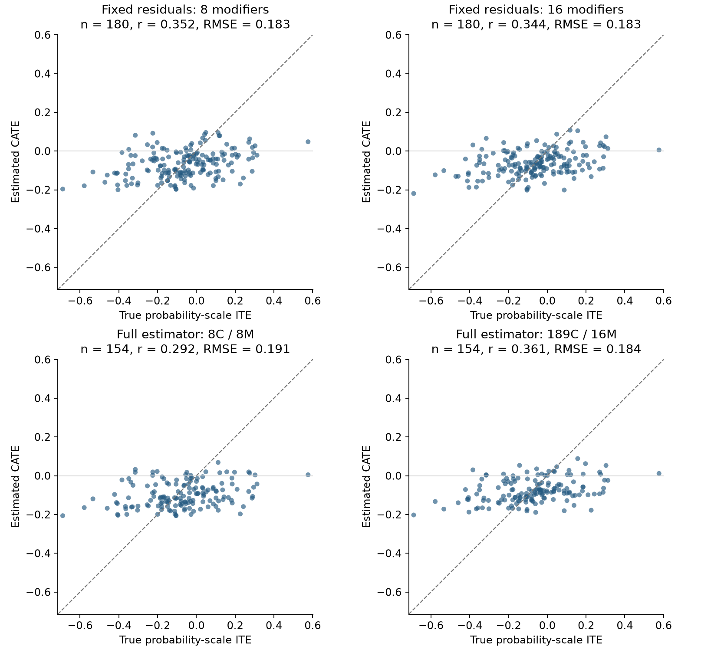

# Fold 1: conservative confounders and moderate modifier pruning — September 21, 2026

1. **Result**
   1. Ran the requested middle ground with **189 confounders and 16 modifiers**, reusing the completed multi-model evidence, saved global ranking, existing extractions, and historical estimator settings.
   2. The full estimator's mean ITE correlation was **0.399**, compared with **0.288** for the previous 8-confounder/8-modifier version. RMSE was **0.182 versus 0.189**. These summaries use each estimator's eligible population; the common-patient comparison appears below.
   3. Direct correct-role recovery was **5/5 confounders and 3/5 modifiers**, versus 2/5 and 1/5 previously. Retention means availability to the fitted models; it does not guarantee nonzero elastic-net coefficients or accurate extracted measurements.
   4. With nuisance residuals and patients fixed, moving from eight to 16 modifiers changed correlation from **0.364 to 0.373**, and RMSE from **0.1818 to 0.1814**. The incremental gain from this modifier change was small.

2. **How the middle ground was constructed**
   1. Restored all 189 confounders in the original multi-model role adjudication. Used the top 16 modifiers from the already accepted global review. No new LLM review or extraction was needed.
   2. Sixteen had the lowest previous mean inner-fold R-loss: **0.1882194**, versus 0.1884813 for eight, 0.1889159 for 31, and 0.1902919 for the broad 224 reference. The earlier paired one-standard-error rule chose eight; this comparison uses the mean-loss winner.
   3. There are **197 distinct candidates**: 189 confounders, 16 modifiers, and eight with both roles. The forest receives the 16 modifiers in X and the 181 remaining confounders in W. Dual-role candidates appear once in X and also enter nuisance adjustment. External propensity models use the 189 confounders; outcome nuisance models use all 197 retained candidates.
   4. Forests retain 200 trees, minimum leaf size 10, square-root split search, 45% subsampling, honesty and inference enabled, and no forest tuning. Native estimation retains elastic-net logistic nuisance models, the original five inner splits, propensity eligibility 0.1–0.9, and clipping at 0.02.

3. **Modifier comparison with everything else fixed**
   1. Reused the original all-candidate elastic-net residuals, 720 training patients, 180 held-out patients, and three forest seeds. This evaluates the change in forest inputs without also changing the adjustment fit or eligibility.
   2. Mean results across the three seeds:

      | Model | Held-out n | ITE correlation | ITE RMSE | CATE bias | Estimated effect SD | 95% interval coverage |
      | --- | ---: | ---: | ---: | ---: | ---: | ---: |
      | 224 modifiers | 180 | 0.255 | 0.191 | 0.021 | 0.028 | 49.6% |
      | 8 modifiers | 180 | 0.364 | 0.182 | -0.002 | 0.069 | 51.5% |
      | 16 modifiers (new) | 180 | 0.373 | 0.181 | 0.004 | 0.062 | 51.9% |

   3. The 16-modifier design has **54 encoded columns**, versus 28 for eight and 705 for 224. Relative to eight, mean correlation changed by +0.010 and RMSE by -0.0004. The broad reference was reused from frozen predictions.
   4. The 16-modifier version improved correlation and RMSE over eight in only one of three matched seeds; that larger improvement outweighed two smaller degradations. Held-out R-loss was slightly worse for 16 in all three seeds (mean 0.1886691 versus 0.1882474). There is no decisive evidence here that 16 is intrinsically a better forest size than eight.

4. **Full estimator with conservative adjustment**
   1. Refitted nuisance models and the forest for three seeds. The new run retained 645–686 training and 170 held-out patients after propensity screening; the previous run retained 583–592 and 157 respectively.
   2. Results on each estimator's own eligible population:

      | Model | Held-out n | ITE correlation | ITE RMSE | CATE bias | Estimated effect SD | 95% interval coverage |
      | --- | ---: | ---: | ---: | ---: | ---: | ---: |
      | 8 confounders / 8 modifiers | 157 | 0.288 | 0.189 | -0.004 | 0.063 | 50.3% |
      | 189 confounders / 16 modifiers (new) | 170 | 0.399 | 0.182 | -0.001 | 0.060 | 55.1% |

   3. Results restricted to patients eligible under both estimators, without refitting either model:

      | Model | Held-out n | ITE correlation | ITE RMSE | CATE bias | Estimated effect SD | 95% interval coverage |
      | --- | ---: | ---: | ---: | ---: | ---: | ---: |
      | 8 confounders / 8 modifiers | 154 | 0.289 | 0.190 | -0.004 | 0.063 | 50.2% |
      | 189 confounders / 16 modifiers (new) | 154 | 0.395 | 0.182 | 0.003 | 0.061 | 55.8% |

   4. On the common patients, correlation changed by +0.105 and RMSE by -0.007. This controls the evaluation population, but both the adjustment set and modifier set changed. The comparison does not isolate their separate contributions.
   5. AIPW estimates the average treatment effect; it is separate from the mean forest CATE. The following intervals are the native estimated intervals for each seed, not uncertainty across independent datasets:

      | Model | Seed | Eligible n | AIPW ATE | Estimated 95% interval | Oracle eligible ATE |
      | --- | ---: | ---: | ---: | --- | ---: |
      | 189 confounders / 16 modifiers (new) | 100042 | 170 | +0.047 | [-0.090, +0.184] | -0.066 |
      | 189 confounders / 16 modifiers (new) | 1100042 | 170 | +0.060 | [-0.080, +0.199] | -0.066 |
      | 189 confounders / 16 modifiers (new) | 2100042 | 170 | +0.047 | [-0.090, +0.184] | -0.066 |
      | 8 confounders / 8 modifiers | 100042 | 157 | +0.091 | [-0.085, +0.267] | -0.072 |
      | 8 confounders / 8 modifiers | 1100042 | 157 | +0.078 | [-0.097, +0.254] | -0.072 |
      | 8 confounders / 8 modifiers | 2100042 | 157 | +0.095 | [-0.077, +0.268] | -0.072 |

   6. Across seeds, mean AIPW ATE was **+0.051**, versus mean oracle ATE **-0.066** in the corresponding eligible populations. Previous values were +0.088 and -0.072. The new point estimates still have the wrong sign, although all three estimated 95% AIPW intervals include the oracle ATE. This single fold does not separate sampling error from estimation bias.
   7. New native-population ITE correlation ranged from 0.361 to 0.465 across seeds. Estimated effects remain compressed: mean estimated SD **0.060**, versus oracle ITE SD **0.197**. The reported interval coverage is coverage of the full oracle ITE, so omitted modifiers and approximation error also contribute; it is not a formal validation of intervals for CATE conditional only on the selected X.

5. **Which oracle variables survived**
   1. Correct-role recovery, counted using the existing direct lineage audit after prediction freezing:

      | Oracle variable | Role | Previous 8C/8M retained it? | New 189C/16M retained it? |
      | --- | --- | --- | --- |
      | age | Confounder | Yes | Yes |
      | sex | Confounder | No | Yes |
      | ECOG | Confounder | Yes | Yes |
      | creatinine clearance | Confounder | No | Yes |
      | prior platinum exposure | Confounder | No | Yes |
      | histology | Modifier | No | No |
      | EGFR status | Modifier | No | Yes |
      | NLR | Modifier | Yes | Yes |
      | brain metastasis presence | Modifier | No | Yes |
      | hemoglobin | Modifier | No | No |

   2. The missing modifier concepts are **histology, hemoglobin**. They were not manually restored from oracle knowledge. Related proxies are recorded separately in the [recovery audit](oracle_recovery_2026-09-21.json).
   3. The 16 modifiers, in their previously frozen global order:

      | Existing global rank | Candidate | Also a confounder? |
      | ---: | --- | --- |
      | 1 | neutrophil_to_lymphocyte_ratio (228) | Yes |
      | 2 | serum_albumin (295) | Yes |
      | 3 | dizziness_present (103) | No |
      | 4 | cancer_related_fatigue_severity (060) | No |
      | 5 | confusion_present (085) | No |
      | 6 | bone_metastasis_presence (043) | Yes |
      | 7 | anxiety_present (022) | No |
      | 8 | dyspnea_severity (108) | Yes |
      | 9 | medication_cisplatin (204) | No |
      | 10 | medication_pemetrexed (212) | Yes |
      | 11 | brain_metastases_presence (052) | No |
      | 12 | mediastinal_lymph_node_dissection_performed (201) | Yes |
      | 13 | biomarker_egfr_status (032) | Yes |
      | 14 | kras_g12c_variant_allele_frequency (179) | No |
      | 15 | met_amplification_status (214) | No |
      | 16 | line_of_therapy (184) | Yes |

6. **Visual comparison**
   1. First seed only; tables above average all three seeds. Each row uses the same patients for its two panels. The bottom row uses the common production-eligible patients. Dashed lines indicate perfect agreement.

      

7. **What this experiment can establish**
   1. This is a post-hoc comparison on an already examined fold. Earlier oracle findings motivated the requested variant. Its role sets were assembled mechanically from prior frozen outputs, and all six new prediction sets were frozen before computing this run's oracle metrics. That sequence does not make the test set untouched again.
   2. The same inner folds informed the global ranking and the prefix scores. The tiny mean-loss advantage of 16 over eight is an adaptive tuning result, not evidence of a statistically established optimum.
   3. Three seeds measure algorithmic variation on the same patients. They do not provide three independent validation datasets. Recovery of an oracle candidate does not repair missing or inaccurate text extraction, guarantee its coefficient survives shrinkage, or ensure that a forest recovers its interaction.
   4. This experiment preserves broad confounder availability while limiting forest split candidates. Broader availability can still leave difficult high-dimensional nuisance fits. Assessment on other outer folds would be required before adopting this as a generally better policy.

8. **Verification and saved artifacts**
   1. Integrity checks **passed**: exact frozen inputs and prior predictions, all 189 inherited confounders, the unchanged top-16 ranking, original measurement definitions, treatment/outcome row alignment, nuisance role routing, and matched rows/residuals.
   2. Inspected all **12 actual internal fitted nuisance clones**. All use elastic-net logistic regression; **0** reached the recorded iteration limit. The final audit records encoded X/W dimensions and effective forest parameters. This clone audit does not independently certify every external nuisance CV path.
   3. [Protocol](PROTOCOL_2026-09-21.md), [input manifest](input_manifest_2026-09-21.json), [selection freeze](selection_frozen_2026-09-21.json), [prediction freeze](predictions_frozen_2026-09-21.json), [per-seed metrics](metrics_by_seed_2026-09-21.csv), [evaluation](evaluation_2026-09-21.json), [all role decisions](all_role_decisions_2026-09-21.csv), and [final validation](final_validation_2026-09-21.json).
   4. Experiment-only scripts and outputs are in this dated folder. The core estimator and previous experiment files were preserved.
