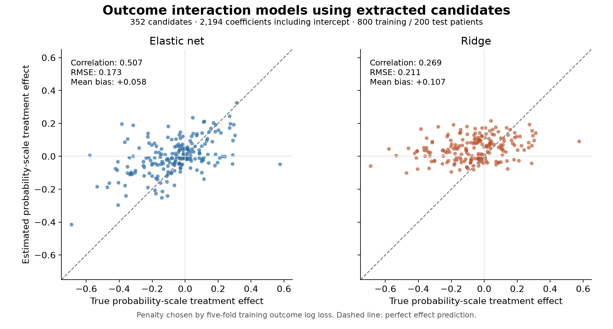

# Fold 1: penalized outcome models using all extracted candidates

Date: September 21, 2026. Separate exploratory estimation experiment.

## 1. Main result

**Elastic net improved treatment-effect estimation over the previous all-candidate causal forests, but remained far below the known-DGP oracle logistic benchmark. Ridge performed worse at effect estimation.**

### 1.1. Primary analysis: all 800 training patients, all 200 held-out patients

| Model | Effect correlation | Effect RMSE | Mean bias | Mean predicted effect | Prediction SD |
| --- | --- | --- | --- | --- | --- |
| Elastic net | 0.50660 | 0.17282 | 0.05832 | -0.00242 | 0.10831 |
| Ridge | 0.26884 | 0.21121 | 0.10681 | 0.04607 | 0.07019 |

1. True held-out effect mean: **-0.06074**; true effect SD: **0.18807**.
2. Elastic net estimated the average effect as approximately **−0.0024**, versus true **−0.0607**. Its predicted effect SD was **0.1083**, versus true **0.1881**. Improved ranking did not produce well-calibrated individual effects or an accurate average effect.
3. Ridge's average effect estimate was **+0.0461**, opposite in sign to the true average. Its effect estimates were more compressed and its effect RMSE was worse.
4. All models used extracted clinical measurements. No true covariate values, oracle-selected feature identities, true coefficients, or known DGP interaction terms were supplied.

### 1.2. Matched comparison: the same 720 training and 180 test patients as the earlier forests

The earlier forests excluded patients outside their estimated-propensity eligibility range. Separate logistic fits were trained on exactly those 720 training patients and evaluated on the identical 180 test patients. This isolates the estimator comparison from differences in included patients.

| Model | Effect correlation | Effect RMSE | R-loss | Prediction SD |
| --- | --- | --- | --- | --- |
| Elastic net | 0.52020 | 0.17946 | 0.18896 | 0.10907 |
| Ridge | 0.30248 | 0.21404 | 0.18787 | 0.06959 |
| Forest: all features at each split | 0.33639 | 0.18826 | 0.18980 | 0.03307 |
| Forest: square-root feature search | 0.18409 | 0.19410 | 0.19030 | 0.02498 |

1. Elastic net reduced effect RMSE by **4.67%** relative to all-feature split search, and by **7.54%** relative to square-root search.
2. The forest rows average the individual scores of three historical seeds. The logistic models each use one fixed optimization seed, with their penalty selected inside training.
3. Ridge had a slightly lower held-out R-loss despite worse true-effect RMSE. Those empirical criteria do not rank these fitted models identically on this fold.
4. The full 800-patient elastic-net model evaluated on these same 180 test patients had correlation **0.49773** and RMSE **0.18054**. Both row policies therefore gave the same broad conclusion.

## 2. What was fitted

### 2.1. Extracted candidate inputs

1. Used all **352 candidates** in the frozen fold-1 all-candidates arm, from the completed 26B A4B extraction refresh. No new extraction or candidate screening was performed.
2. Reconstructed the exact training frame and held-out measurements, preserving categorical Python types and the existing harmonization rules. The resulting eligible-patient matrices reproduced the previous forest design hashes exactly.
3. Used the existing feature encoder: median imputation and training-derived scaling for continuous variables, categorical indicator columns, and the existing missingness/fallback indicators.
4. The design contained **1,096 encoded covariate columns** in both outer-training cohorts. Constants and redundant indicator columns were retained, as in the source representation.

### 2.2. Outcome model and effect calculation

The fitted model was:

`logit P(Y=1 | T,Z) = intercept + beta·Z + delta·T + gamma·(T×Z)`

1. Included all 1,096 covariate main-effect columns, a treatment main effect, and all 1,096 treatment interactions, plus an intercept: **2,194 coefficients in total**.
2. Treatment interactions also cover the encoded category and missingness indicators. No covariate-by-covariate interactions were added.
3. Used observed binary treatment and outcome. Effect estimates are `predicted P(Y=1|T=1,Z) − predicted P(Y=1|T=0,Z)`.
4. Tested elastic net with **L1 ratio 0.8**, and ridge/L2. Each model uses one shared penalty strength for the main effects and interactions. All slopes, including the treatment main-effect coefficient, are penalized; the intercept is unpenalized.
5. In both elastic-net fits, the treatment main-effect coefficient was shrunk to zero. Its interactions still generate nonzero treatment effects. Full categorical coding contains redundant parameterizations, so individual coefficients should not be interpreted in isolation.

### 2.3. Penalty selection and optimization

1. Selected C by the smallest mean observed-outcome log loss across the original **five inner training folds**. For the 720-patient analysis, those fold memberships were intersected with the existing eligibility mask.
2. Fitted imputation, scaling, and encoding separately inside each inner training partition. Outer-test outcomes and oracle effects were unavailable to penalty selection.
3. Used 13 C values, logarithmically spaced from **0.0001 through 100**. Smaller C means stronger regularization. Every candidate converged in all folds; no C value was excluded for nonconvergence, and no selected value was at the grid boundary.
4. Elastic net used SAGA; ridge used L-BFGS. Tolerance was 0.0001; iteration limits were 5,000 for CV and 20,000 for final fitting. Optimization seed: 120042.

| Training patients | Model | Selected C | Mean CV log loss | Final iterations | Nonzero main coefficients | Nonzero interaction coefficients |
| --- | --- | --- | --- | --- | --- | --- |
| 800 | Elastic net | 0.10000 | 0.55468 | 572 | 67 | 13 |
| 800 | Ridge | 0.00316 | 0.57193 | 43 | 1011 | 991 |
| 720 | Elastic net | 0.10000 | 0.57013 | 627 | 63 | 12 |
| 720 | Ridge | 0.00316 | 0.58348 | 47 | 1011 | 982 |

5. The primary elastic-net model had **80 nonzero slopes**: 67 covariate main effects and 13 treatment interactions, at a numerical threshold of 1e-8. This is a coefficient count, not a claim that there are 13 true effect modifiers or that its effective degrees of freedom are exactly 80.

## 3. Outcome prediction and retained interactions

### 3.1. Outcome prediction is a different diagnostic

| Model | Held-out factual log loss | Held-out factual AUC |
| --- | --- | --- |
| Elastic net | 0.57809 | 0.75073 |
| Ridge | 0.56439 | 0.77862 |

Ridge predicted the observed outcomes slightly better on this test set, while estimating treatment effects substantially worse. The penalty was selected for outcome prediction; these results do not establish that this criterion is sufficient for selecting an effect estimator.

### 3.2. Nonzero treatment interactions in the 800-patient elastic-net model

These are coefficients on the encoded **log-odds interaction terms**, not probability-scale treatment effects or verified causal feature roles.

| Treatment interaction term | Coefficient |
| --- | --- |
| neutrophil_to_lymphocyte_ratio:value | -0.50540 |
| ki67_proliferation_index:value | 0.18025 |
| medication_cisplatin:category=Yes | -0.12652 |
| alkaline_phosphatase_level:value | -0.10209 |
| met_amplification_status:category=Amplified | -0.09287 |
| absolute_lymphocyte_count:value | -0.05578 |
| psychiatric_symptom_presence:category=Present | 0.04546 |
| brain_lesion_count:value | 0.04286 |
| creatinine_clearance:value | 0.04238 |
| prior_platinum_chemotherapy:category=No | 0.03212 |
| serum_sodium:value | 0.03125 |
| radiation_therapy_session_count:value | -0.01655 |
| lesion_size:value | 0.00990 |

### 3.3. How well did elastic net recover the true variable roles?

**Direct role recovery was weak: 3/5 confounders retained as main effects, and only 1/5 true log-odds effect modifiers retained as a treatment interaction.** This audits the final penalized outcome model, not the earlier nuisance or statistical-selection models. Oracle identities were used only for this post-fit audit.

| Oracle concept | DGP role | Direct main effect retained | Direct treatment interaction retained |
| --- | --- | --- | --- |
| age | confounder | Yes | No |
| sex | confounder | No | No |
| ecog_performance_status | confounder | Yes | No |
| creatinine_clearance | confounder | No | Yes |
| prior_platinum_therapy | confounder | Yes | Yes |
| histology_type | effect_modifier | No | No |
| egfr_mutation_status | effect_modifier | No | No |
| baseline_nlr | effect_modifier | No | Yes |
| brain_metastases_status | effect_modifier | Yes | No |
| baseline_hemoglobin | effect_modifier | No | No |

1. The primary fit retained **67 main-effect coefficients spanning 60 candidates**, and **13 treatment-interaction coefficients spanning 13 candidates**, out of 352 input candidates. Sparsity therefore did not imply accurate recovery of the intended roles.
2. **Confounders:** age, ECOG, and prior platinum therapy retained direct main effects. Creatinine clearance appeared only as a treatment interaction, bringing direct confounder-concept retention anywhere in the model to **4/5**. The direct biological-sex candidate was absent. A gender-identity indicator was selected as a main effect, but the saved lineage treats this as a separate construct rather than direct biological-sex recovery. Presence only in an interaction does not establish sufficient confounder adjustment.
3. **Modifiers:** NLR was the only direct modifier retained as a treatment interaction. Histology, EGFR status, and hemoglobin were omitted from both blocks. Brain-metastasis presence remained as a main effect only; brain lesion count also appeared as a treatment interaction and is a possible proxy, not a direct match to the oracle presence/status variable.
4. The other 12 selected interaction candidates were not direct matches to the five designated modifiers. This does **not** establish 12 causal false positives: some are proxies or confounders, and the extracted model can redistribute signal when measurements or functional form are imperfect. Main effects can influence probability-scale treatment differences even without a log-odds interaction.
5. The separate **720-patient fit reached the same direct recovery counts**: 3/5 confounders as main effects, 4/5 confounder concepts anywhere, and 1/5 modifiers as interactions. It retained 63 main-effect coefficients spanning 58 candidates and 12 interaction candidates. It additionally selected hematocrit as a main effect and interaction, a possible hemoglobin proxy; these proxy relationships were not quantitatively evaluated here.
6. Selection used observed-outcome prediction loss with a common penalty on main effects and interactions. It was not optimized for recovery of confounder identities or treatment-interaction support. This single-fold result shows weak direct recovery under that specification; it does not isolate whether measurement error, correlated proxies, regularization, or sample size caused each omission.

## 4. Interpretation and limits

1. The large nominal coefficient count did not prevent fitting or modest improvement over the all-candidate forests. Elastic net imposed substantial sparsity.
2. The result remains much worse than the earlier **0.977 correlation / 0.0414 RMSE** from the correctly structured logistic model using true oracle covariates on the same original 800/200 split. That benchmark received both perfect measurements and the correct functional structure. This experiment also changes candidate dimensionality, so the performance gap cannot be attributed to any one of those differences alone.
3. The current model retains substantial mean-effect bias and compressed effect variation. Correlation alone would overstate its success.
4. This is an exploratory analysis of one previously inspected fold. The candidate definitions and measurements were already frozen, but this is not a new blinded validation dataset or evidence of performance across other DGPs.
5. No uncertainty intervals for the penalized logistic treatment effects were estimated in this experiment.

## 5. Verification and artifacts

1. All 260 CV candidate fits and all four final models converged without warnings. Predictions and models were frozen at **2026-09-21T20:41:11+00:00**, before evaluation loaded true treatment effects.
2. A separate validator reconstructed all 260 CV prediction sets and scores, checked all 20 inner encoders, independently reproduced all four selected penalties, and reloaded the four final models.
3. Final potential-outcome probabilities and treatment-effect predictions were independently calculated from the saved coefficients. Maximum absolute discrepancy was below **5.6e-16**. All eight logistic evaluation rows were independently verified.
4. The saved forest references matched their original hashes, and all source and experiment artifact hashes passed verification. Production code and the ongoing extraction experiment were not modified.

- [Logistic metrics for both training and test populations](logistic_metrics_2026-09-21.csv)
- [Matched forest/logistic comparison](matched_comparison_2026-09-21.csv)
- [Evaluation details](evaluation_2026-09-21.json)
- [Effect prediction figure, PDF](effect_predictions_2026-09-21.pdf)
- [Primary elastic-net coefficients](fits/all_800/elastic_net/coefficients.csv)
- [Primary elastic-net penalty selection](fits/all_800/elastic_net/selection.json)
- [Direct oracle-concept selection in both training cohorts](oracle_variable_selection_2026-09-21.csv)
- [Post-fit selection audit, coefficients, proxy distinctions, and source hashes](variable_selection_audit_2026-09-21.json)
- [Selection-audit script](audit_variable_selection_2026-09-21.py)
- [Input preparation script](prepare_inputs_2026-09-21.py)
- [Frozen extracted inputs](inputs_frozen_2026-09-21.json)
- [Fitting and evaluation script](run_logistic_interactions_2026-09-21.py)
- [Experiment specification](input_manifest_2026-09-21.json)
- [Frozen predictions and model hashes](predictions_frozen_2026-09-21.json)
- [Independent validation](independent_validation_2026-09-21.json)
