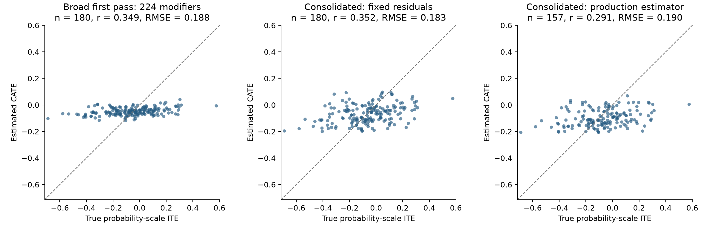

# Fold 1: multi-model selection with global consolidation — September 21, 2026

1. **Main result**
   1. Reducing the forest from 224 to eight modifier candidates improved the matched-population mean ITE correlation from **0.255 to 0.364** and RMSE from **0.191 to 0.182** across three seeds.
   2. The full consolidated workflow still has substantial selection failures: only **2/5 direct confounders and 1/5 direct modifiers** survived. The production refit reached correlation **0.288**, and its AIPW ATE had the opposite sign from the oracle ATE in the eligible population. This result supports reducing the modifier search space while exposing a separate problem in confounder retention.

2. **What changed**
   1. The initial multi-model Stage 2 review retained 270 candidates, including 189 confounders and 224 modifiers. Its final decisions were made in small batches after theme review; retention was too broad to produce a compact modifier set.
   2. Following the user's request, added a global comparison of all 352 candidates, explicit redundancy groups, separate confounder representatives, and a ranked modifier shortlist capped at 32. This is an experimental pass in a separate folder; the production repository implementation and original frozen evidence remain unchanged.
   3. Reused all 305 numerical family/subset cells, the five original inner folds, and the saved Gemma 4 26B A4B extractions for 800 training / 200 held-out patients. No extraction was rerun. The expensive broad production refit was stopped before oracle access; the broad selection remains a matched-residual forest comparison.

3. **Global review and compact-size choice**
   1. Gemma 4 31B reviewed every candidate together, including measurement definitions, training availability, all seven modeling families, score magnitudes/signs, fold support, and available p/q values and permutation variability. Its review returned 5 explicit groups, 8 confounder representatives, and 31 ranked modifier candidates. Code preserved 341 other candidates as separate singletons.
   2. Groups choose existing extracted measurements. No new values were constructed or pooled. Related biological concepts do not by themselves establish measurement equivalence; the proposed groups and their rationales remain available for audit. After two failed attempts to enumerate every candidate explicitly, [output revision 2](PROTOCOL_AMENDMENT_revision2_2026-09-21.md) assigned unchanged-candidate bookkeeping to code while preserving the substantive selection constraints.
   3. Evaluated compact ranked prefixes and a constant effect using two forest seeds on each of five inner folds. Reused nested training-only elastic-net residuals and held propensity eligibility fixed. The minimum-mean-loss compact option had 16 modifiers; the paired one-standard-error simplification chose **8 modifiers**.

      | Modifier count | Mean inner-fold R-loss | Paired SE of loss difference vs best | Use |
      | --- | ---: | ---: | --- |
      | 0 | 0.1906915 | 0.0002301 | eligible compact option |
      | 8 | 0.1884813 | 0.0008103 | chosen |
      | 16 | 0.1882194 | 0.0000000 | eligible compact option |
      | 31 | 0.1889159 | 0.0005293 | eligible compact option |
      | broad_224 | 0.1902919 | — | reference only |

   4. The 32-feature cap was specified before this evaluation, using the existing subset size as an engineering budget. The broad 224-feature reference was not eligible to win compact-size selection. The same inner folds had informed the global ranking, so this is adaptive tuning; the standard-error rule is a simplification heuristic, not an independent uncertainty guarantee.

4. **Final selection and oracle recovery**
   1. Frozen final selection: **16 distinct candidates**, **8 confounders**, and **8 modifiers**. Roles may overlap.
   2. Selected modifiers: anxiety_present, bone_metastasis_presence, cancer_related_fatigue_severity, confusion_present, dizziness_present, dyspnea_severity, neutrophil_to_lymphocyte_ratio, serum_albumin.
   3. Direct recovery in the correct role: **2/5 confounders and 1/5 modifiers**. C = confounder; M = effect modifier. Numeric IDs below are candidate suffixes.

      | Oracle variable | True role | Final candidate roles | Correct role recovered? |
      | --- | --- | --- | --- |
      | age | C | 009: C | Yes |
      | sex | C | 302: none | No |
      | ECOG | C | 109: C | Yes |
      | creatinine clearance | C | 095: none | No |
      | prior platinum exposure | C | 267: none | No |
      | histology | M | 192: none | No |
      | EGFR status | M | 032: none; 111: none | No |
      | NLR | M | 228: M | Yes |
      | brain metastasis presence | M | 052: none | No |
      | hemoglobin | M | 155: none | No |

   4. Proxy audit, excluded from direct counts: gender identity: not selected; brain lesion count: not selected; hematocrit: not selected; eGFR: confounder.
   5. Direct correct-role recovery through the broad → global → final stages: confounders **5/5 → 2/5 → 2/5**; modifiers **3/5 → 3/5 → 1/5**. The [recovery funnel](recovery_funnel_2026-09-21.json) identifies where each variable was retained or lost.
   6. [Global groups and ranked candidates](global_response.json), [all final decisions](all_role_decisions_2026-09-21.csv), and [direct lineage audit](oracle_recovery_2026-09-21.json) preserve the reasoning and exclusions.
   7. Losses by step: histology was absent from the broad modifier selection; global review dropped hemoglobin, sex, direct creatinine clearance, and prior platinum exposure, while adding brain metastasis presence to the modifier shortlist. Brain metastasis presence ranked 11th and EGFR ranked 13th, so both disappeared when the eight-modifier prefix was chosen. NLR survived throughout. Renal proxies remained, but they are not counted as direct creatinine-clearance recovery.

5. **Effect estimation on the matched population**
   1. Fixed the same 720 training / 180 held-out patients, earlier all-candidate elastic-net residuals, and three forest seeds. All methods use 200 trees, honesty/inference enabled, minimum leaf size 10, 45% subsampling, and sqrt split search except the explicitly labeled all-column comparator.
   2. Values are means over three seeds. The compact-vs-broad comparison changes only the modifier inputs and their resulting encoded forest design, which shrank from **705 to 28 columns** after category and missingness encoding.

      | Selection / inputs | ITE correlation | ITE RMSE | Mean bias | Estimated effect SD |
      | --- | ---: | ---: | ---: | ---: |
      | Previous joint elastic-net selection | 0.296 | 0.188 | 0.021 | 0.057 |
      | Previous LLM selection | 0.286 | 0.192 | 0.028 | 0.087 |
      | Previous permissive union | 0.338 | 0.188 | 0.028 | 0.041 |
      | All 352; sqrt split search | 0.184 | 0.194 | 0.026 | 0.025 |
      | All 352; all-column split search | 0.336 | 0.188 | 0.024 | 0.033 |
      | First multi-model pass; 224 modifiers | 0.255 | 0.191 | 0.021 | 0.028 |
      | Consolidated selection; 8 modifiers | 0.364 | 0.182 | -0.002 | 0.069 |

   3. Mean correlation changed by +0.109 relative to the broad first pass. Mean RMSE changed by -0.009; lower is better.
   4. Across seeds, broad-selection correlation ranged from 0.175 to 0.349; compact-selection correlation ranged from 0.352 to 0.374.

6. **Production estimation with consolidated roles**
   1. Used the existing estimator, with modifiers in forest X and pure confounders in W. Refitted elastic-net nuisance models and propensity eligibility. Three independent forest seeds ran in parallel with one numerical thread each.
   2. Mean ITE correlation: **0.288**; RMSE: **0.189**; mean bias: **-0.004**; estimated-effect SD: 0.063.
   3. Eligibility produced 583–592 training and 157 held-out patients. These populations and nuisance fits differ from the matched comparison above, so their performance difference cannot be attributed solely to confounder selection.
   4. Mean AIPW ATE: +0.088; mean oracle ATE in the corresponding eligible populations: -0.072. These differ conceptually from the mean forest CATE.

      

   5. The figure shows the first seed; tables summarize all three. Dashed lines indicate perfect agreement.

7. **Limits and next opportunities**
   1. This is one exploratory outer fold after prior fold-1 oracle diagnostics had been seen in earlier work. All new selection choices and nine final predictions were frozen before this experiment opened oracle values. No oracle roles/values or outer-test outcomes entered the LLM review or compact-size choice.
   2. Consolidation addresses redundancy and dimension. It cannot repair missing/error-prone extraction or create statistical power. The global review also remains fallible, and a forced candidate budget can discard a real modifier.
   3. Positive forest/R-learner support fractions are not calibrated tests against noise. A future experiment could add independent noise features to assess how readily the workflow promotes null candidates. That diagnostic alone would not establish formal error control.
   4. Compare role recovery, ITE ranking, RMSE, bias, and eligibility together. Three seeds quantify algorithmic variability on this dataset; they are not independent clinical samples. Evaluation of other outer folds would be needed before claiming general improvement.
   5. The immediate design opportunity is to separate conservative confounder retention from aggressive modifier reduction. The matched comparison already shows benefit from compact forest X with broad all-candidate nuisance residuals. The global review's deletion of three direct confounders is a reason to scrutinize its adjustment policy before using the full consolidated workflow.

8. **Reproducibility**
   1. [Prespecified consolidation protocol](PROTOCOL_2026-09-21.md), [size choice](size_choice.json), [selection freeze](selection_frozen_2026-09-21.json), and [prediction freeze](predictions_frozen_2026-09-21.json).
   2. [Per-seed metrics](metrics_by_seed_2026-09-21.csv), [evaluation](evaluation_2026-09-21.json), and [source/input manifest](input_manifest_2026-09-21.json).
   3. Final integrity checks passed, including frozen-file hashes, observed-label row alignment, inherited oracle lineage, and all 12 fitted nuisance clones. 0 clones reached the iteration limit. See the [final audit](final_validation_2026-09-21.json).
