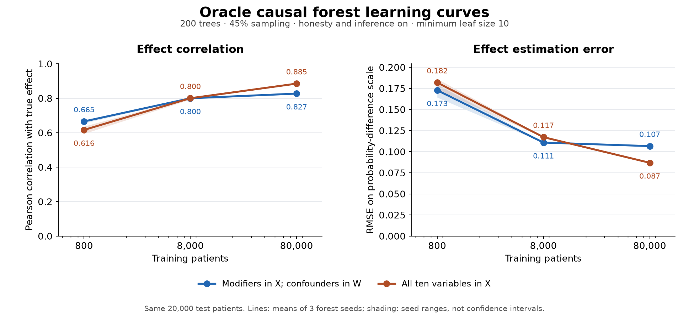

# Oracle causal forest: 100,000-row sample-size experiment

Date: September 21, 2026.

## 1. Answer to the power-versus-capacity question

**The approximately 0.67 correlation is not a fixed ceiling of this causal forest on this DGP. More independent training data improves performance substantially with the historical settings unchanged.**

On nested training samples from a new 100,000-patient cohort, modifier-only forests improved from correlation **0.665 to 0.827** between 800 and 80,000 training patients. When the final forest could split on all ten true variables, correlation improved from **0.616 to 0.885**. Both configurations were evaluated on the same 20,000 independent test patients.

This supports a substantial finite-sample/data-efficiency limitation of the historical estimator. It argues against a fundamental inability to learn this DGP, but does not show that all remaining error would vanish with more data. The 80,000-patient all-variable forest still has RMSE 0.0869, estimated nuisance functions remain imperfect, and only one generated cohort was examined.

### 1.1. Controlled learning curve

Each entry is the mean of three separate forest-seed scores. The cohorts are nested, and every model is evaluated against the full probability-scale true effect on the same 20,000 test rows.

| Training patients | Modifiers in X: correlation | Modifiers in X: RMSE | All ten variables in X: correlation | All ten variables in X: RMSE |
|---:|---:|---:|---:|---:|
| 800 | 0.66536 | 0.17282 | 0.61626 | 0.18189 |
| 8,000 | 0.79990 | 0.11077 | 0.80018 | 0.11720 |
| 80,000 | **0.82701** | **0.10660** | **0.88488** | **0.08685** |

1. From 800 to 80,000 training patients, mean RMSE fell by **38.32%** for modifier-only X and **52.25%** for all-variable X.
2. At each matched seed, increasing sample size improved correlation and RMSE for both configurations.
3. At 80,000 patients, all-variable X reduced RMSE by **18.52%** relative to modifier-only X. Correlation was higher by 0.05787.
4. At 80,000 patients, seed ranges were narrow: correlation 0.82604–0.82812 with modifier-only X, and 0.88393–0.88601 with all-variable X.

### 1.2. Why confounders in X matter in the larger sample

1. The modifier-only configuration kept the five true modifiers in X and the five true confounders in W for nuisance adjustment. The all-variable configuration placed all ten variables in X, with no additional W columns. Both used exactly the same fitted nuisance residuals at each sample size.
2. The DGP has the form `tau(C,M) = sigmoid(g(C) + h(M)) - sigmoid(g(C))`. Thus confounders influence the full probability-scale effect through baseline risk, even though the designated modifiers supply the treatment interactions on the log-odds scale.
3. At 800 patients, supplying these additional effect inputs did not help. At 80,000 patients, it did. This is consistent with a finite-sample tradeoff: the additional conditioning information becomes useful when there are enough observations to estimate the richer effect function.
4. A modifier-only forest cannot distinguish patients whose modifiers match but whose confounders differ. Its lower large-sample performance should therefore not be interpreted as a universal representation limit of causal forests.
5. This comparison does not numerically partition the remaining error among incomplete conditioning, forest approximation, nuisance estimation, and outcome noise.

## 2. Connection to the original fold-1 results

The existing 800-patient forests were also evaluated on the new 20,000-patient test set, without refitting and using their original encodings and nuisance models.

| Existing forest configuration | Original 200 test rows: correlation / RMSE | New 20,000 test rows: correlation / RMSE |
|---|---:|---:|
| Modifiers in X, confounders in W | 0.67577 / 0.14997 | 0.71367 / 0.13837 |
| All ten variables in X | 0.62283 / 0.16070 | 0.62036 / 0.15447 |

1. The earlier 0.67 was partly specific to the small test set: the same modifier-only models scored approximately 0.714 on the larger independent test set.
2. Even against those original models on the common large test, the 80,000-patient forests improved correlation to 0.827/0.885 and reduced RMSE by **22.96%/43.77%**, respectively.
3. The new 800-patient training subset had substantially larger mean-effect bias, around −0.10, than the original 800-patient models, around −0.02 on the new test. Reporting both baselines avoids relying solely on the comparatively poor RMSE of that one new small training sample.
4. The three forest seeds are algorithmic replications on fixed training samples. They are not three independent generated cohorts or a repeated-sampling power study.

## 3. Dataset generation

### 3.1. Existing generator and unchanged DGP

1. Generated exactly **100,000 new patients** using the repository's `_build_patient_scaffold_record` function in `synthetic_data/generator.py`.
2. Loaded the existing five-confounder/five-modifier dataset's saved feature definitions, covariate distributions, treatment equation, and outcome equation using `_load_dgp_metadata`.
3. Reused the final saved coefficients and intercepts. No equations were regenerated, rescaled, or recalibrated, and no LLM services were called.
4. Generated observed binary treatment and binary outcome using the existing Bernoulli sampling process. Preserved the original `enforce_positivity=False`; configured probability bounds remained inactive.
5. Kept structured values and oracle probabilities/effects. Discarded the scaffold's deterministic patient-prompt string and generated no clinical notes or extraction measurements.
6. Used generation seed **20260921**. Independent vectorized calculations reproduced every generated oracle probability/effect to a maximum absolute difference of **3.34 × 10⁻¹⁶**. The same calculation reproduced the original dataset's probabilities/effects to within **2.23 × 10⁻¹⁶**.
7. All 100,000 patient IDs are unique, no values are missing, and no complete covariate row matches the original 1,000-patient dataset.

### 3.2. Preserved generator detail

The saved feature categories use a nonbreaking hyphen in the prior-platinum `First‑line` label, while the distribution dictionary uses an ordinary hyphen in `First-line`. The existing generator matches these strings literally, assigns the unmatched category probability zero, and renormalizes the other categories. This pre-existing behavior was preserved so that the new cohort follows the same implemented DGP. No category names or sampling probabilities were silently corrected. The effective probabilities and observed frequencies are recorded in the generation validation file.

### 3.3. Split and storage

1. Held out 20,000 rows using the first split of shuffled five-fold KFold with seed 42.
2. Randomly ordered the remaining 80,000 rows using seed 120042 and selected nested training sets of 800, 8,000, and 80,000, without consulting outcomes or effect labels.
3. Used five nuisance cross-fitting folds at each size, with shuffled KFold seed 51043. Every training row appeared once as an inner validation row.
4. The generated cohort and fitted model binaries are temporary files under `/tmp/oci_oracle_power_100k_2026-09-21_f9irsz3t/`. Reports, predictions, source hashes, DGP specification, split IDs, and generation/fitting scripts are retained in this dated report folder.
5. Temporary dataset: [structured_oracle_100k.parquet](/tmp/oci_oracle_power_100k_2026-09-21_f9irsz3t/structured_oracle_100k.parquet). These temporary files may be removed by normal temporary-directory cleanup; the saved scripts, seeds, and DGP specification support regeneration.

## 4. Historical estimator settings

1. Used the same native EconML CausalForestDML path as the earlier true-oracle experiments, with observed binary Y and T.
2. Forest settings remained fixed: **200 trees, sample fraction 0.45, honesty on, inference on, minimum leaf size 10, no maximum depth, MSE criterion, square-root feature search, subforest size 4, and one worker**.
3. Forest seeds were **120042, 1120042, and 2120042**. There were 18 new forests: three training sizes × two X configurations × three seeds.
4. Nuisances used the same repository elastic-net logistic wrapper: L1 ratio 0.8, three-fold internal regularization selection, 16 C values from 0.01 to 10,000, maximum 5,000 iterations, tolerance 0.0001, and seed 120042.
5. Each training size fitted its nuisance models once, then shared the exact residuals across all six forests. The first modifier-only forest was the native DML final forest; other fits used the same native final-forest class and parameters on those cached residuals.
6. Preserved full categorical encodings and standardized continuous variables using each outer training sample only. Modifiers contributed 12 encoded columns; confounders contributed 13.
7. No propensity filtering, extraction, feature selection, duplicate nuisance columns, noiseless outcomes, true nuisance functions, or true effect labels were introduced into the model fits.
8. The three independent sample sizes ran in separate local processes; every estimator retained its historical `n_jobs=1` setting.

## 5. Additional diagnostics

### 5.1. Effect scale and nuisance accuracy

The common test-set true effect mean was **−0.07021**, with SD **0.18159**.

| Training patients | Propensity RMSE | Marginal-outcome nuisance RMSE | Modifier-only prediction SD / bias | All-variable prediction SD / bias |
|---:|---:|---:|---:|---:|
| 800 | 0.04973 | 0.07815 | 0.08876 / −0.10197 | 0.05880 / −0.09876 |
| 8,000 | 0.01993 | 0.05625 | 0.14829 / −0.01962 | 0.10656 / −0.01928 |
| 80,000 | 0.01151 | 0.05393 | 0.17882 / −0.01094 | 0.14337 / −0.00928 |

1. Larger samples improve nuisance estimates as well as the final forest. The learning curve measures the full historical estimator's response to sample size, not an isolated experiment holding nuisance accuracy constant across sample sizes.
2. At a given sample size, both X configurations share identical nuisance predictions, so their comparison does isolate the final forest's available effect inputs and resulting split search.
3. At 80,000 patients, the modifier-only prediction SD nearly matches the true SD, yet its correlation and RMSE remain worse than the all-variable forest. Matching overall spread does not ensure correct individual effects.
4. The all-variable forest still compresses effect variation, and the fitted nuisance functions are not exact. Remaining error cannot be labeled an intrinsic causal-forest limit from this experiment alone.

### 5.2. Tree resolution

| Training patients | Patients per tree | Separate split / estimation patients | Median leaves, modifier-only X | Median leaves, all-variable X | Median estimation patients per leaf, M / all |
|---:|---:|---:|---:|---:|---:|
| 800 | 360 | 180 / 180 | 8–9 | 11 | 17 / 15 |
| 8,000 | 3,600 | 1,800 / 1,800 | 86 | 106–107 | 16 / 15 |
| 80,000 | 36,000 | 18,000 / 18,000 | 1,036.5–1,048.5 | 1,004–1,005 | 15 / 15 |

Ranges span per-forest medians across the three seeds; half-integers are possible with 200 trees. The historical minimum leaf size stayed fixed, allowing finer partitions with more data. This is an increase in independent training patients, unlike the earlier experiments that only changed the fraction of the same 800 patients available to each tree.

## 6. Interpretation and limits

1. **Finite-sample limitations are a major contributor.** The same forest settings recover substantially more of the true effect function with more independent patients. Both correlation and RMSE improve, including when using the original fitted small-sample models as the comparison on the same test set.
2. **The estimator can learn this DGP substantially better than 0.67.** Reaching approximately 0.885 with all relevant inputs contradicts treating the earlier plateau as a hard representation ceiling.
3. **Input restriction becomes consequential with enough data.** The large-sample all-variable forest outperforms modifier-only X, whereas it did not at 800 patients. The earlier small-sample result did not establish that confounders were irrelevant to probability-scale effects.
4. **This does not prove that all remaining error is a power issue.** There is still error at 80,000 training patients, and the experiment does not establish an infinite-sample limit or identify the best forest settings at that size.
5. The earlier correctly structured logistic benchmark recovered effects much better from 800 observations on the original test set. That model received favorable knowledge of the DGP's functional form. Together, the experiments point to the forest's much greater data requirements for this DGP, rather than a claim that 800 observations contain no recoverable effect information.
6. Results concern one DGP and one nested sample-size sequence. Forest-seed variability does not account for independent cohort variability, and these exploratory oracle diagnostics do not select a production configuration.

## 7. Verification and artifacts

1. All 18 new forests and all 30 nuisance clones completed without warnings or reaching iteration limits. Maximum nuisance iterations were 550, 71, and 19 at the three training sizes.
2. All 24 prediction sets were frozen at **2026-09-21 18:47:28 UTC**, before the model evaluation phase read true effects. Generation necessarily computed oracle quantities to create and validate the DGP; those columns were excluded from fitting reads.
3. A separate validator reloaded all 24 forests and reproduced every prediction and interval exactly. It independently recalculated scores, checked the actual tree sampling and leaf counts, verified fitted nuisance predictions, and checked all 30 nuisance clone audits.
4. All 81 frozen fit artifacts, generated-data artifacts, source hashes, and original saved forest artifacts passed verification.

- [Learning-curve figure (PDF)](learning_curve_2026-09-21.pdf)
- [Generation script](generate_oracle_100k_2026-09-21.py)
- [Generation manifest](generation_manifest_2026-09-21.json)
- [DGP specification](dgp_specification_2026-09-21.json)
- [Generation validation](generation_validation_2026-09-21.json)
- [Fitting and evaluation script](run_power_comparison_2026-09-21.py)
- [Input manifest](input_manifest_2026-09-21.json)
- [Exact splits](splits_2026-09-21.json)
- [Frozen prediction/model hashes](predictions_frozen_2026-09-21.json)
- [Per-seed metrics](metrics_by_seed_2026-09-21.csv)
- [Mean metrics](summary_metrics_2026-09-21.csv)
- [Evaluation and seed ranges](evaluation_2026-09-21.json)
- [Independent validation](independent_validation_2026-09-21.json)
