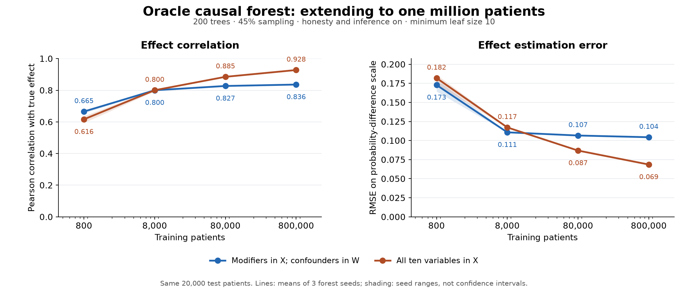

# Oracle causal forest: one-million-patient experiment

Date: September 21, 2026.

## 1. Results

Generated **1,000,000 patients**, trained on **800,000**, and held out **200,000**. On the full test set, the historical forest reached mean effect correlation **0.92698** with all ten oracle covariates in X and **0.83458** with only the five designated modifiers in X. The respective RMSEs were **0.06864** and **0.10451**.

Each result below averages the scores of three separate forest seeds. Predictions were not averaged into an ensemble before scoring.

### 1.1. Full 200,000-patient test set

| Variables in X | Correlation | RMSE | MAE | Mean bias | Prediction SD |
| --- | --- | --- | --- | --- | --- |
| All ten variables | 0.92698 | 0.06864 | 0.05200 | -0.00671 | 0.16010 |
| Modifiers only | 0.83458 | 0.10451 | 0.08048 | -0.00838 | 0.18124 |

The full test-set true probability-scale treatment effect has mean **-0.06947** and SD **0.18097**. `modifiers` means M in X and C in W; `all` means C+M in X with no additional W.

### 1.2. Direct learning-curve comparison on the original common 20,000 test patients

The earlier 100K cohort and its split were preserved exactly. All prior training samples are nested within the new 800K training set, and the original 20K test patients remain held out. Earlier saved predictions were reused and their scores reproduced against the identical truth.

| Training patients | Modifiers: correlation | Modifiers: RMSE | All variables: correlation | All variables: RMSE |
| --- | --- | --- | --- | --- |
| 800 | 0.66536 | 0.17282 | 0.61626 | 0.18189 |
| 8,000 | 0.79990 | 0.11077 | 0.80018 | 0.11720 |
| 80,000 | 0.82701 | 0.10660 | 0.88488 | 0.08685 |
| 800,000 | 0.83594 | 0.10435 | 0.92775 | 0.06856 |

1. **Modifiers only in X:** correlation changed from 0.82701 to 0.83594; RMSE changed from 0.10660 to 0.10435 (2.11% reduction). Correlation improved in 3/3 matched seeds; RMSE improved in 3/3.
1. **All ten variables in X:** correlation changed from 0.88488 to 0.92775; RMSE changed from 0.08685 to 0.06856 (21.06% reduction). Correlation improved in 3/3 matched seeds; RMSE improved in 3/3.

### 1.3. What the additional tenfold increase changes

1. **The all-variable forest continues to improve substantially:** its RMSE falls another 21.06% on the identical test patients when training increases from 80K to 800K. The earlier correlation near 0.67 is not a fixed capacity ceiling with the full oracle input set.
2. **The modifier-only configuration is close to a plateau in this sequence:** its corresponding RMSE improvement is 2.11%. Having confounders available only to nuisance models does not let the final forest distinguish their contributions to the individual probability-scale effect.
3. The two test sets give very similar new-model results, and all three matched forest seeds improve correlation and RMSE for both configurations. This supports the direction of the learning curve, although one generated cohort sequence is not a repeated-cohort uncertainty study.
4. At 800K training patients, estimated propensity RMSE on the full test set is **0.00957**, and marginal-outcome nuisance RMSE is **0.05347**. These are shared by the two final-forest designs. The nuisance functions remain estimated rather than supplied by the DGP.
5. The all-variable forest's nominal 95% intervals contain the individual oracle effect for **86.54%** of test patients. Thus the improved point estimates do not establish calibrated 95% inference. This is empirical coverage across test patients for one training cohort, not a repeated-training-sample coverage experiment. Modifier-only coverage against individual truth is recorded in the metrics, but its restricted conditioning set does not identify that full individual effect.

## 2. Experimental design

### 2.1. Cohort generation and split

1. Used the existing `_build_patient_scaffold_record` generator with the saved five-confounder/five-modifier distributions and final treatment/outcome equations. Generation seed **20260921**.
2. Generated binary observed treatment and outcome. No LLM, clinical-text generation, extraction, recalibration, coefficient changes, or noiseless-outcome substitution.
3. The first 100,000 rows match the preceding generated cohort exactly, including every structured covariate, observed treatment/outcome, and oracle probability.
4. Preserved all previous 80K training and 20K test memberships. Split the additional 900K rows into 720K training and 180K test using the first shuffled five-fold split with seed 42. The combined split is therefore 800K/200K.
5. Used five inner nuisance folds with seed 51043. Each inner heldout fold contains 160K patients; nuisance fitting in that fold uses the other 640K.
6. Retained the original positivity setting (`enforce_positivity=False`) and the pre-existing prior-platinum category-label mismatch described in the [100K report](../oracle_power_100k_2026-09-21/oracle_power_100k_report_2026-09-21.md). No generator behavior was corrected during this comparison.
7. Independent vectorized calculations reproduced all one million rows' oracle probabilities/effects within 4.45e-16. No values are missing and all patient IDs are unique.

### 2.2. Historical estimation settings

1. **200 trees; 45% sampling; honesty on; inference on; minimum leaf size 10; no maximum depth; square-root feature search; MSE criterion; subforest size 4.** Forest seeds: 120042, 1120042, 2120042.
2. Two final-forest designs: five true modifiers in X and five true confounders in W, or all ten true variables in X with no additional W. Full categorical encoding yields 12 modifier columns and 13 confounder columns. Continuous-variable scaling uses only the outer training sample.
3. Both configurations share exactly the same estimated nuisance residuals. The nuisance design includes all ten variables once; nuisance models are fitted once and reused across all six final forests.
4. Nuisances retain the historical elastic-net logistic specification: L1 ratio 0.8; three-fold internal regularization selection; 16 C values from 0.01 through 10,000; maximum 5,000 iterations; tolerance 0.0001; seed 120042.
5. The initial model uses native CausalForestDML. Remaining forests use its exact final-forest class, parameters, and cached cross-fitted residuals.
6. Every estimator retains `n_jobs=1`. Up to three independent final forests run concurrently. No forest parameters were tuned to the new outcomes or true effects.
7. Fitting reads only oracle covariates and observed T/Y. True propensity, potential-outcome probabilities, and true treatment effects are excluded from fitting. No propensity filtering or feature selection.

### 2.3. Tree resolution

1. Each tree samples **360,000** patients, with separate sets of **180,000** patients for split selection and effect estimation.
1. **Modifiers only in X:** median leaves per tree 11,225.0–11,349.5; median effect-estimation patients per leaf 14. All 800,000 training patients appear in both roles across each forest.
1. **All ten variables in X:** median leaves per tree 9,059.0–9,107.0; median effect-estimation patients per leaf 15. All 800,000 training patients appear in both roles across each forest.
1. The leaf-size threshold remains fixed as the dataset grows, so more data mainly permits more partitions; it does not impose larger leaves.

## 3. Interpretation and limits

1. The common-test learning curve above isolates additional training data from a change in test patients. It measures the whole historical estimation procedure, including the improvement in estimated nuisance functions.
2. At any one training size, the X-placement comparison shares exactly the same nuisance estimates and isolates which variables the final forest can use for effect estimation.
3. The DGP's probability-scale effect is `sigmoid(g(C)+h(M)) - sigmoid(g(C))`. A modifier-only forest cannot distinguish patients with the same modifiers but different baseline-risk covariates. A plateau in that configuration does not establish a causal-forest capacity limit with all relevant inputs.
4. Remaining error can involve finite-sample forest approximation, estimated nuisance error, fixed hyperparameters, outcome noise, and restricted conditioning. This experiment does not separately identify those contributions or establish an infinite-sample limit.
5. Three seeds measure algorithmic variation on one nested cohort sequence, not repeated independent cohort uncertainty. This is an oracle diagnostic, not an observed-data selection of a production model.

## 4. Verification and retained artifacts

1. Predictions and models were frozen at **2026-09-21T19:57:23+00:00**, before the evaluation phase loaded true effects. Generation necessarily computed oracle quantities to create and validate the cohort, but those columns were not read by fitting.
2. The independent validator reloaded all six saved forests and reproduced all 200K test predictions and intervals exactly. It independently recomputed metrics on both test sets, checked forest parameters and actual tree structure, and verified source/artifact hashes.
3. All six forests and all ten fitted nuisance clones completed without warnings. Every one of the 800K out-of-fold nuisance predictions was independently reproduced from the saved fold models. No nuisance model reached the iteration limit; maximum iterations observed: **17**.
4. Temporary dataset and model binaries are stored under `/tmp/oci_oracle_power_1m_2026-09-21_o2_aun8d`. Normal temporary-directory cleanup may remove them; generation scripts, seeds, splits, and the safe DGP specification support regeneration.
5. Production source code and the previous experiments remain unchanged.

- [Temporary structured dataset](/tmp/oci_oracle_power_1m_2026-09-21_o2_aun8d/structured_oracle_1m.parquet)
- [Learning-curve PDF](learning_curve_2026-09-21.pdf)
- [Per-seed metrics](metrics_by_seed_2026-09-21.csv)
- [Mean metrics](summary_metrics_2026-09-21.csv)
- [Evaluation and seed ranges](evaluation_2026-09-21.json)
- [Generation script](generate_oracle_1m_2026-09-21.py)
- [Generation manifest](generation_manifest_2026-09-21.json)
- [Generation validation](generation_validation_2026-09-21.json)
- [DGP specification](dgp_specification_2026-09-21.json)
- [Exact split indices](splits_2026-09-21.npz)
- [Fitting/evaluation script](run_power_comparison_2026-09-21.py)
- [Input manifest](input_manifest_2026-09-21.json)
- [Frozen artifact hashes](predictions_frozen_2026-09-21.json)
- [Independent validation](independent_validation_2026-09-21.json)
