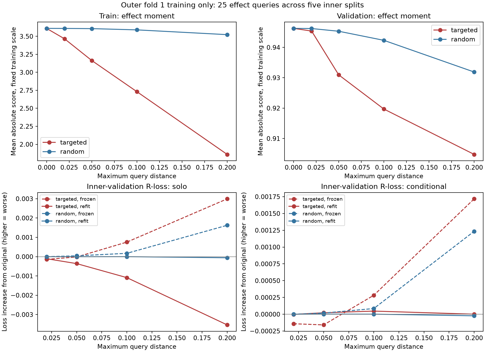

# Stage 1 query-perturbation pilot — September 22, 2026

**Finding:** Targeted edits changed training associations and retrieval, but this pilot does not demonstrate removal of useful effect information or better feature discovery than random perturbation. The original query probes already had weak inner-validation performance. This was an effect-query pilot; treatment and outcome prediction were secondary checks, and direct nuisance-query erasure was not attempted.

1. **Experiment and scope**
   1. Evaluated 25 saved effect queries across the five inner splits of outer fold 1. Each edit, probe, and LLM packet used only its 640 training patients; evaluation used its corresponding 160 inner-validation patients.
   2. **No outer-test patient, outer-test outcome, or oracle variable was used.** All edits, predictions, and 75 independent LLM responses were frozen before inner-validation scoring. Every one of 4,000 nuisance-prediction training registries was checked for self-training and split leakage.
   3. Exact-context cached TF-IDF nuisances were held fixed. They are correctly scoped but differ from the unpersisted nuisance fits originally used to optimize these neural queries. This pilot recomputes its own baseline moments.
   4. Targeted edits minimize a fixed-scale effect moment with bounded query distance and preserved activation variance. Five seeded random edits match each actual distance. Radius selection, restart selection, and LLM evidence selection did not use validation outcomes.

2. **Effect-score attenuation**
   1. Before editing, mean absolute effect score on the fixed training scale was 3.6107 in training and 0.9463 in inner validation.
   2. Scores below use each query's original training row-score standard deviation. They are descriptive diagnostics; a small moment can conceal nonlinear or cancelling signal. Random controls are averaged within the balanced query/fold design.

| Distance budget | Train: targeted | Train: random | Validation: targeted | Validation: random |
| --- | --- | --- | --- | --- |
| 0.02 | 3.4650 | 3.6100 | 0.9454 | 0.9462 |
| 0.05 | 3.1647 | 3.6071 | 0.9310 | 0.9453 |
| 0.1 | 2.7316 | 3.5898 | 0.9197 | 0.9423 |
| 0.2 | 1.8599 | 3.5236 | 0.9048 | 0.9319 |

   3. A fixed-scale moment can fall partly because activation amplitude shrinks. The optimizer permits SD down to half its original value. The next table recomputes the row-score standard deviation for each edited query, making a simple activation rescaling insufficient to reduce the score. Neither score alone proves information erasure.

| Sample | Original mean absolute standardized score | Targeted at 0.20 | Random at 0.20 |
| --- | --- | --- | --- |
| train | 3.6107 | 2.4817 | 3.6016 |
| validation | 0.7172 | 0.7892 | 0.7192 |

3. **Does a new predictor recover the information?**
   1. A frozen probe retains the model fitted to original activations. A refitted probe learns from edited training activations. The conditional probe uses all 15 queries with one effect query replaced; the solo probe uses only that query.
   2. The table uses the prespecified 0.20 radius. Positive loss increases mean worse inner-validation effect prediction. Positive original gain means improvement over a fitted constant-effect model.

| Scope | Probe | Original R-loss | Original gain vs constant | Targeted frozen Δ | Targeted refit Δ | Random frozen Δ | Random refit Δ |
| --- | --- | --- | --- | --- | --- | --- | --- |
| solo | linear | 0.205793 | -0.009023 | +0.002992 | -0.003535 | +0.001624 | -0.000057 |
| solo | spline | 0.198957 | -0.002187 | +0.004617 | -0.000241 | -0.000423 | -0.000032 |
| conditional | linear | 0.217822 | -0.021053 | +0.001717 | +0.000001 | +0.001234 | -0.000023 |
| conditional | spline | 0.205299 | -0.008530 | +0.001932 | +0.000156 | -0.000620 | -0.000024 |

   3. These fixed linear and additive spline probes test a limited family of readouts. They do not establish removal of every nonlinear interaction, and this is not a new outer-test CATE evaluation.

   4. The following split-level results use radius 0.20. Score columns use each query's own row-score standard deviation. The last two columns compare refitted linear probe R-loss for targeted versus matched random edits; positive differences mean targeted edits hurt prediction more. Each row averages five queries and their balanced random controls. The five training sets overlap, so these are descriptive repeats rather than five independent experiments.

| Inner split | Original score | Targeted score | Random score | Solo targeted − random R-loss | Conditional targeted − random R-loss |
| --- | --- | --- | --- | --- | --- |
| 1 | 0.5362 | 0.8944 | 0.5419 | +0.000857 | +0.001267 |
| 2 | 0.4299 | 0.4487 | 0.4311 | -0.000362 | +0.000163 |
| 3 | 0.8806 | 0.6407 | 0.8729 | -0.001392 | +0.002030 |
| 4 | 1.0223 | 1.1114 | 1.0300 | -0.015430 | -0.003012 |
| 5 | 0.7170 | 0.8506 | 0.7200 | -0.001062 | -0.000329 |

4. **Secondary nuisance prediction changes**
   1. Changes in inner-validation log loss after refitting, at radius 0.20. Positive values mean worse prediction. Nuisance independence was not imposed as a requirement for a valid modifier.

| Target | Scope | Probe | Targeted Δ log loss | Random Δ log loss |
| --- | --- | --- | --- | --- |
| treatment | solo | linear | +0.000267 | -0.000039 |
| treatment | solo | spline | +0.000267 | +0.000015 |
| treatment | conditional | linear | +0.001242 | +0.000093 |
| treatment | conditional | spline | +0.000162 | +0.000070 |
| outcome | solo | linear | +0.000120 | -0.000027 |
| outcome | solo | spline | -0.000152 | -0.000046 |
| outcome | conditional | linear | -0.000331 | +0.000034 |
| outcome | conditional | spline | +0.001271 | +0.000090 |

5. **LLM candidate proposals**
   1. Gemma 4 31B at the requested endpoint interpreted three independent conditions per query: original retrieval, targeted-edit contrast, and random-edit contrast. Each request allowed at most six training patients, four complete excerpts per patient, and two proposed variables. Literal citation quotes were validated, with errors returned for repair.
   2. Unique-name counts below mean exact case-normalized names, not independently established clinical concepts. Differences in wording are not evidence of novel feature discovery. Duplicate excerpts were combined; the table reports actual excerpt counts.

| Condition | Requests | Proposals | Unique names | Mean excerpts | Most frequent names (count) |
| --- | --- | --- | --- | --- | --- |
| original | 25 | 44 | 29 | 22.9 | ecog performance status (8); pd-l1 tumor proportion score (tps) (4); stk11 status (4); egfr mutation status (2); kras g12c mutation status (2); stk11 alteration status (1) |
| targeted | 25 | 50 | 30 | 15.9 | ecog performance status (14); kras g12c mutation status (2); pd-l1 expression (2); tp53 p.r273c mutation (2); creatinine clearance (crcl) (2); creatinine clearance (2) |
| random | 25 | 50 | 31 | 14.1 | ecog performance status (10); egfr mutation status (4); pd-l1 tumor proportion score (tps) (4); tumor histology (2); tumor mutational burden (tmb) (2); pd-l1 expression (tps) (2) |

   3. Complete definitions, extraction instructions, role hypotheses, citations, and uncertainties are saved in [candidate proposals](pilot_v1/candidate_proposals_2026-09-22.json). Per-query interpretations are in [the interpretation table](pilot_v1/interpretations_2026-09-22.csv). These variables have not yet been newly extracted or validated in Stage 2.

   4. There is one stochastic LLM draw per query/condition. Differences between candidate lists can reflect model sampling as well as changed retrieval. There is no repeated-identical-prompt control, and exact-name counts are not a test of discovery superiority.

   5. Original packets show high-activation retrieval, whereas both edited conditions show retrieval contrasts. Packets identify their condition, so the LLM comparison is not blinded. A future discovery comparison should match packet format, hide condition labels, and repeat identical-prompt controls.

   6. In the training patients selected for contrast packets, targeted edits changed the highest-similarity chunk in 22/150 patient-query instances; random edits did so in 4/150. These are descriptive retrieval diagnostics: conditions select different patients, and repeated patient-query instances are not independent observations.

6. **How to interpret this pilot**
   1. **The objective changed mainly in training.** At radius 0.20, the mean fixed-scale score fell about 48.5% in training and 4.4% in inner validation. After recalculating each query's row-score SD, the validation score increased from 0.7172 to 0.7892; it decreased in only one of the five inner splits. This does not support robust attenuation beyond amplitude changes.
   2. **Refitting largely removed the prediction penalty.** The conditional linear probe's R-loss increase went from +0.001717 with its original fitted head to about +0.000001 after refitting. The solo linear probe improved after refitting, although its larger average improvement was concentrated in inner split four. These findings are consistent with representation changes and training-specific associations, rather than dependable information erasure.
   3. **The baseline is the larger issue.** Mean constant-effect R-loss was 0.196769. Every original probe family/scope had worse average loss: 0.198957–0.217822. Both conditional probe families were worse than the constant baseline in every inner split. There was therefore little demonstrated useful effect prediction to erase with these readouts. This does not establish that the texts contain no effect modifiers, and the pilot's fixed nuisances differ from those used in the original query optimization.
   4. **Retrieval changed, but discovery superiority was not established.** Targeted edits produced 50 proposals and random edits produced 50, with substantial overlap in broad clinical themes. Exact-name counts do not measure distinct concepts, and no proposed variable has been newly extracted or evaluated for incremental value. The candidate comparison also lacks blinded, repeated identical-prompt controls.
   5. **Recommended next step:** first establish a query/readout combination with reproducible inner-validation gain over a constant effect. Then test perturbations constrained to a smaller, interpretable subspace or use chunk/concept ablations. Treat contrast retrieval as an additional source of candidate evidence; do not use successful training-score suppression as a gate for including or excluding clinical features. This is a recommendation, not another experiment already performed.
   6. Any subsequent candidate extraction and modeling comparison should keep each inner split's discoveries within that split through training and validation. Pooling discoveries across inner splits before evaluating them would reuse information from their validation patients. The outer-test patients should remain sealed until the final outer-fold workflow is fixed.
   7. All results are exploratory on a previously examined cohort. Overlapping training sets, queries, and random seeds are not independent cohorts. No hyperparameters were selected from these new validation results, and this pilot reports no new outer-test CATE performance.

7. **Artifacts and reproducibility**
   1. [Prespecified protocol](PILOT_PROTOCOL_2026-09-22.md); [input and source manifest](pilot_v1/manifest.json); [isolation audit](pilot_v1/ISOLATION_AUDIT_2026-09-22.json).
   2. [Signal metrics](pilot_v1/signal_metrics_2026-09-22.csv); [probe losses](pilot_v1/probe_losses_2026-09-22.csv); [probe summary](pilot_v1/probe_summary_2026-09-22.csv).
   3. Independent frozen numerical and LLM artifacts support a checked evaluation replay. Reproduction scripts are contained in this research directory; production workflow files were not edited.

   4. Use `run_numerical.py` as the numerical entry point. It gives each fold a fresh process, avoiding repeated PyTorch interop initialization in the original scheduler. The frozen fitting implementation and completed checkpoints were preserved. Six focused tests passed; 36 real frozen prediction vectors were reproduced exactly without validation labels.

   5. The evaluator was restarted to cache compressed arrays once per split, avoiding repeated decompression. Scoring formulas and frozen predictions were unchanged. The original first-validation-access record and prior evaluator were preserved in `pilot_v1/runtime_revisions/evaluator_array_cache/`.

